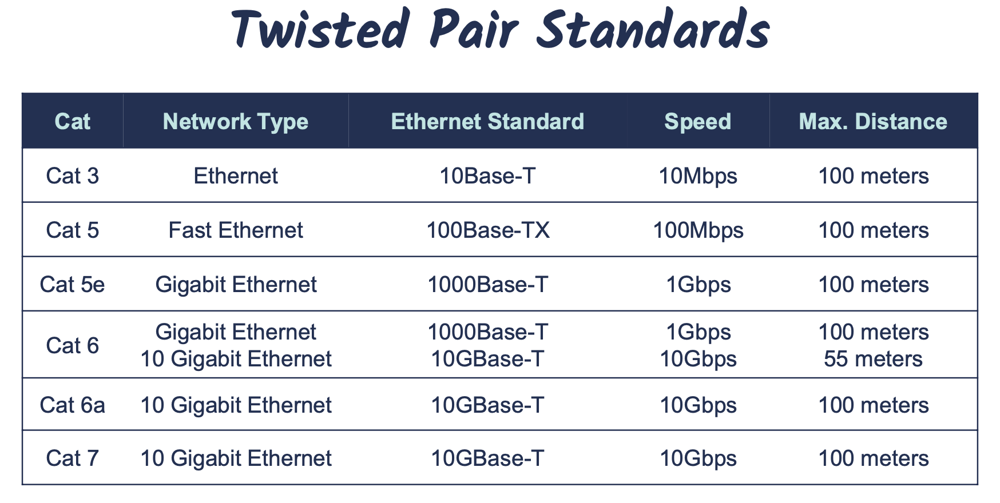
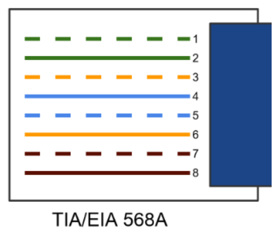
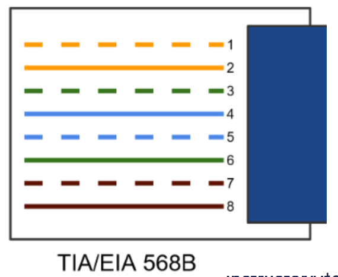
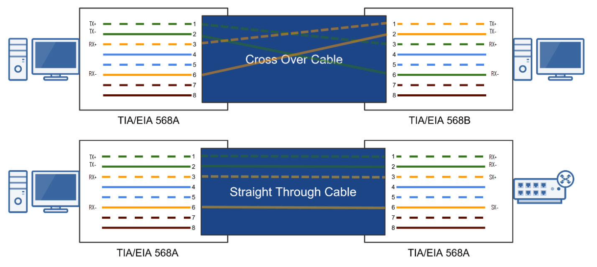

# Types of Network Cabling

## Ethernet Explained

- Ethernet is a network protocol that controls how data is transmitted over a LAN.
- It's referred to as the Institute of Electrical and Electronic Engineers(IEEE) 802.3 Standard
- It supports networks built with coaxial, twisted-pair, and fiber-optic cabling.
- The original Ethernet standard supported 10Mbps speeds, but the latest supports much faster gigabit speeds.
- Ethernet uses CSMA/CD & CSMA/CA access methodology.

**Ethernet N[Signaling]-X Naming**
Ethernet uses an "xx Base T" naming convention: 10Base-T

- N: Signaling Rate, i.e., Speed of the cable
- [Signaling]: Signaling Type: Baseband(Base) Communication
- X: Type of cable (twisted-pair or fiber)

Cat: Copper Cabling Standard

## Coaxial

Antiquated technolohy used in the 1980s. Coaxial cables are rarely used today, except cable modem connections.

F-Connector

- Screw-on connection
  - RG69(Thinner) and RG-6(Thicker) Cables

BNC Connectors

- Tension spring twist-on connection

## Twisted Pair Copper Cabling

- 4 Twisted Pairs of Wires with RJ-45 Connector
- Balanced pair operation
  - Positive & Negative signals
  - Equal & Opposite signal
- Why are they twisted?
  - To help reduce interference
    - Crosstalk
    - Noise(Electromagnetic Interference)
- Security Concerns
  - Signal Emanations
- 100 Meters Maximum Distance
  - Signal Attenuation

## Shielded vs. Unshielded & EMI

- Unshielded Twisted Pair(UTP)
  - More susceptible to electromagnetic Interference(EMI)
- Shielded Twisted Pair(STP)
  - Less susceptible to EMI & Crosstalk(if each pair shielded)
- Electromagnetic Interference
  - The disruption of the operation of an electronic device when it's in the vicinity of an electromagnetic field caused by another electronic device(manufacturing equipment, microwave ovens, etc.)

## Roles of Twists

Increased twists per inch:

- Reduces crosstalk
- Increases signals
- Suports faster speeds

## TIA/EIA 568A & 658B Wiring Standards

- Industry standard that specifies the pin arrangement for RJ-45 connectors.
- Two Standards:
  - 568A & 568B
- 568B is newer and recommended standard
- Either can be used.
- Why are standards important?
  - Lower costs
  - Increase interoperability
  - Easier maintenance

## Straight-Through & Crossover Cables

Straight-Through Cable

- Connecting "Unlike" Devices
  - Computer to Switch
  - Switch to Router

Crossover Cable

- Connecting "Like" Devices
  - Router to Router
  - Computer to Computer

## Which Twisted Pairs Are Used?

**10Base-T and 100Base-T**
Only green and orange pairs used

- Pins 1,2,3, and 6
  - One pair to transmit data(TX)
  - One pair to receive data(RX)

**Gigabit Ethernet(Cat 5e & Faster)**
All four pairs used

- Supports bi-directional data transmission on each pair of wires

## The Plenum

- The plenum is the open space above the ceiling or below a raised-floor.
- A "plenum space" is the part of a building that enables air circulation by providing pathways for heated/air-conditioned and return airflows at a higher pressure than normal.
- All network cabling placed in the plenum should be "plenum-rated"

Non-Plenum-Rated & Fire Hazard

- Non-plenum cable or polyvinyl chloride(PVC) cable is often much less expensive than plenum cable.
- When PVC burns or smolders it releases toxic fumes into the air(Hydrochloric Acid and Dioxin)
- A plenum air return would unknowingly circulate toxic air throughout an office.
- Sprinkler systems cannot typically access plenum area.
- Building codes often requires Plenum Rated cable installed through any plenum air retrun space.

Plenum-Rated Cables

- Plenum-rated cables have a special insulation(Teflon coated) taht has low smoke, low fame and non-toxic characteristics.
- If they catch fire, they won't release toxic fumes.

## Fiber Optic

- Glass or plastic fiber that carries light(photons)
  - High Bandwidth: Photons travel faster than electrons.
  - Long Distances: Less attenuation.
  - Immune to Electromagnetic Interference(EMI)
  - Doesn't emanate signals
- Multi-mode Fiber(MMF)
  - Shorter distances(LAN/Building to Building)
  - Up to 2 Kilometers
- Single-mode Fiber(SMF)
  - More expensive than multi-mode
  - Longer distances(WAN/Across town)
  - Up to 200 Kilometers

### MMF vs. SMF

Multi-Mode Fiber(MMF)

- Many photons of light travel through the cable at once, and bounce off the walls, which reduces the distance and speed.
- Larger Core: 50 to 62.5 microns

Signle-Mode Fiber(SMF)

- A single direct photons of light travels through the cable, which allows greater distances and speed.
- Smaller Core: 8 to 10 microns

### Fiber Optic Cable Connectors

Lucent Connector(LC)

- Small form-factor design that has a flange on the top, similar to an RJ-45 connector.
- Commonly used in MMF & SMF gigabit and 10-gigabit Ethernet networks

Subscriber Connector(SC)

- Square connector that uses a push-pull connector similar to A/V equipment
- Commonly used in MMF & SMF gigabit Ethernet networks

Straight Tip(ST)

- BNC style connector with a half-twist bayonet locking mechanism
- Was used in MMF networks but not commonly used anymore

Mech. Transfer Register Jack(MTRJ)

- Similar to the RJ-45 connector, and houses two fiber optics cables.
- Designed for MMF networks

---

## Cable Selection Criteria

Cost Constraints

- What is your budget?

Transmission Speed Requirements

- How fast does your network need to be?
- 10Mbps, 100Mbps, 1Gbps, 10Gbps?

Distance Requirements

- Electrical signals degrade relatively quickly (100 meters)
- Fiber can tansmit over long distances

Noise & Interference Immunity(Crosstalk, EMI, Security)

- Interference is all around us: power cables, microwaves, mobile phone, motors, etc.
