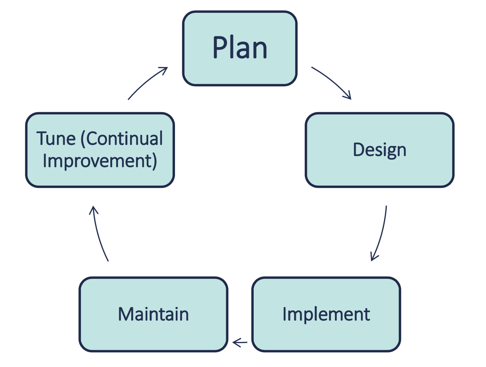

# Planning a Network

## Why do we do it?

Many small and medium business utilize an ad hoc network design witha break-fix mentality.

## Ad Hoc Networks with a Break-Fix Mentality can Lead to Issues

- Troubleshooting issues
- Scalability issues
- Reliability issues
- Security issues
- Data loss issues
- Costly repairs

## The Overall Process

## Understanding the Business

- You must understand the business to properly plan and deisgn a network for it.
- Business and regulatory requirements drive technical needs
- What are the business's core and strategic competencies?

### You should preform the following

- Business Process Analysis: Understand business processes
- Business Impact Analysis: Define essential business processes
- Key Stakeholder Interviews: Analyses Established via Interviews
- Examine Regulatory Requirements: Review all regulatory requirements

## Ask, How Can IT and a Network Help the Organization?

- Increased Operational Efficiencies via Business Process Improvement
- Decreased IT and Operational Costs
- Increasing Profitability, i.e., the Bottom Line
- Ensure we Meet Regulatory requirements
- Increased Network Security Posture

## Define Specific Areas of Improvement

Some Areas of Improvement

- Improved communications and Data Sharing
  - Knowledgebase Software or Service
  - Interoffice Chat System(Video/Audio)
  - Voice Over IP(VoIP) Phones
- Automated Business Processes
  - Digitize Antiquated Paper-Based Processes
  - Automate Essential Business Processes
  - Automate Reporting with On-Demand Dashboards
- Implementation of Business Intelligencce Solutions
  - Business Objects
- Implementation of a Data Backup System
  - Ensure Data is Properly Backed Up and Restorable
- Enhanced Information Security
  - Better Protect the Company Against Network and Data Breaches

## Buy-In & Resources

- Obtain Management / Customer Approal & Buy-In
  - Initial Proposal
- Obtain the Necessary Resources
  - Funding
  - Personnel
  - Time

## Understand the Hidden Costs

- Planning a Network Involves More than Just
  - Designing the physical and logical network
  - Planning equipment purchases
  - Selecting necessary software
- Networks Change the Way People Work(Process Improvement & Change Management)
  - Resistance to change and instituting change management
  - Training costs(end-users and administrators)
  - Documentation & ongoing support costs
  - Transition planning

## Some Considerations

- Assess your needs against available technologies
  - What are the latest trends?
  - Virtualization
  - Cloud Computing
- Pick the solutions that best fit your needs
- Weigh your solutions options against your financial budget

### Bandwidth Requirements

- High or Low Bandwidth?
- 100 Mbps or Gigabit Speeds?

### Size and Scalability

- Plan for further growth?
- Equipment will handle size and growth?

### Security Needs

- Regulations & Requirements
- Encryption?
- Physical & Logical Security?
- Twisted Pair or Fiber Optics?

### Specialized Software Requirements

- What are they?

## Planning Questions

You should ask questions regarding the following

- Network Type(Peer-to-Peer or Client-Server)
- Network Cabling(UTP, STP, Fiber Optic, Wireless)
- Printer Requirements(Centralized or not)
- E-mail Requirements(Internal or External)
- Data Requirements(Centralized)
- Network Security Requirements(Logical & Physical)
