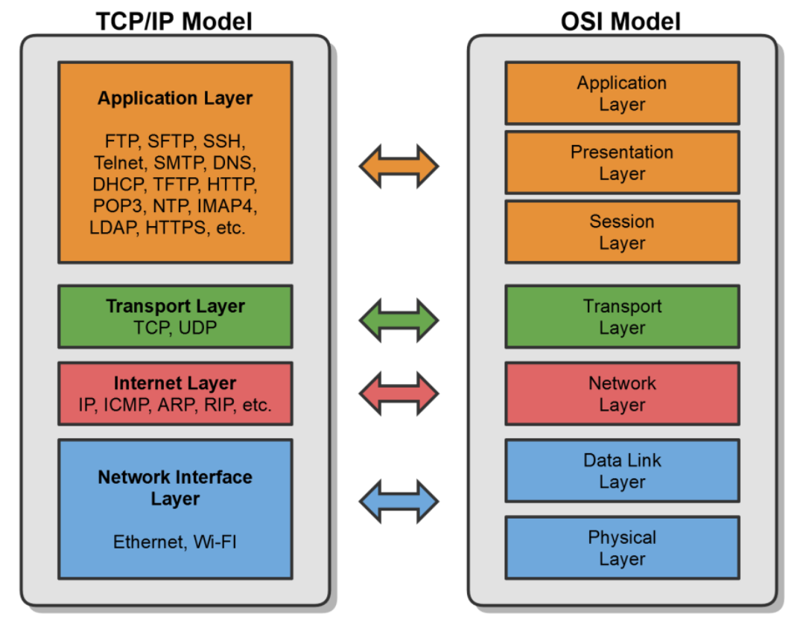
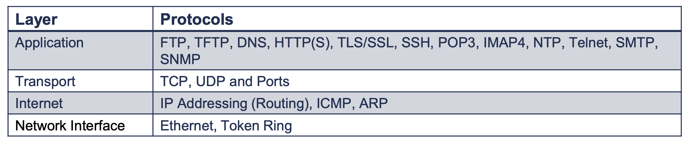

# Introduction to TCP/IP

## What is TCP/IP?

- Transmission Control Protocol/Internet Protocol
- Commonly called the Internet Protocol suite because it was designed for the Internet, but LANs use it too.
- First two protocols defined in the suite were
  - TCP & IP, hence TCP/IP
- Similar to the OSI Model, but simpler
  - OSI is conceptual
  - TCP/IP was implemented

## TCP/IP Protocols

## Network Access Methods

CSMA

- Carrier Sense
  - Checks network for communication
- Multiple Access
  - Multiple devices using the network
- Collision Detection
  - Wired Network
- Collision Avoidance
  - Wireless Network

Token Ring

- The Token
  - Passes between devices on the network.
  - Only devices with the token can send data.
  - Token prevents network collisions.
