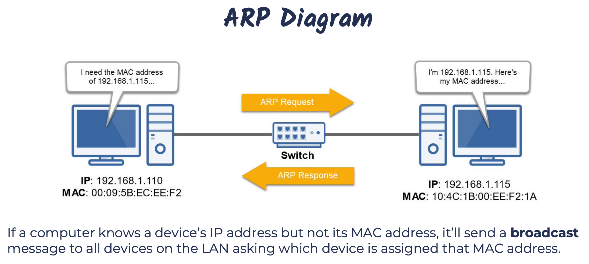

# TCP/IP Network Layer Protocols

## Address Resolution Protocol(ARP)

- Resolves IP address to MAC Addresses
- Finds the hardware addres of a host from a know IP address
  - And vice versa(RARP)
- ARP Command: arp -a

## The Internet Protocol(IP)

- An OSI Layer 3 protocol that defines routing and logical addressing of packets that allow data to traverse WANs and the Internet.
- It specifies the formatting of packets and the logical addressing schema.
  - IP addresses: IPv4 and IPv6
- Its job is to cennect different OSI Layer 2(switched) networks together.
- Provides end-to-end connectivity from one Layer 2 network to another via routers.
- It's connectionless and, therfore, unreliable(similar to UDP)
  - No continued connection.
- Each packet sent is independent of each other packet
  - TCP and other protocols provide a means to reassemble them properly.
- Packets don't always follow the same path to their destination.
  - They're sent via the most efficient route.
- Doesn't provide any error recovery or sequencing functionality.
  - That's the job of other protocols.

## Internet Control Message Protocol(ICMP)

- OSI Layer 3 Internet Protocol(IP) companion "error reporting" protocol within the TCP/IP suite of protocols.
- Just like IP, it's connectionless.
- Used to generate error messages to the source IP address when network issues prevent delivery of a packet.
- Typically used by routers to report packet delivery issues, and, most importantly, it can report errors but not correct them.
- Commonly used by IT administrators to troubleshoot network connections with command-line utilities, including ping, pathping, and traceroute.
- For IPv6, it is also used For
  - Neighbor Solicitation and Advertisement Messages(Similar to ARP)
  - Router Solicitation and Advertisement Messages

## Some ICMP Message Types

- Echo Request, Echo Reply
  - Thests destination accessibility and status. A host sends an Echo Request and listens for a corresponding Echo Reply. Commonly done using the ping command.
- Destination Unreachable
  - Sent by a router when it can't deliver an IP packet.
- Source Quench
  - Sent by a host or router if it's receiving too much data than it can handle. The message requests that the source reduces its rate of data transmission.
- Redirect Message
  - Sent by a router if it receives a packet that should have been sent to a different router. The message includes the IP address to which future packets should be sent, and is used to optimize the routing.
- Tiem Exceeded
  - Sent by a router if a packet has reached the maximum limit of routers through which it can trabel.
- Router Advertisement, Router Solicitation(IPv6)
  - Allow hosts to discover the existence of routers. Routers periodically broadcast their IP addresses via Router Advertisement messages. Hosts may also request a router IP address by broadcasting a Router Solicitation message, then wait for a router to reply with a router Advertisement.
