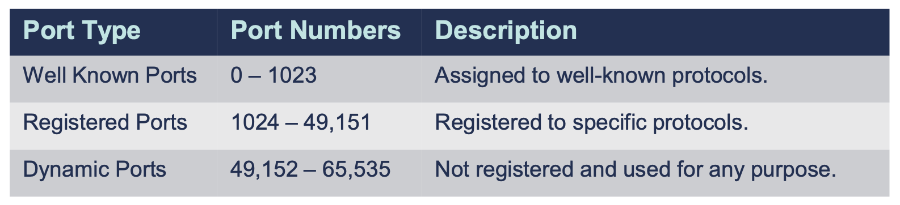

# TCP/IP Transport Layer Protocols

## Understanding Protocols, Prots, and Sockets

Protocols

- Computers communicate with each other with network protocols.
- Protocols are rules governing how machines exchange data and enable effective communication.
- In an operating system(OS), a protocol runs as a process or service.

Ports

- Ports are logical constructs that bind a unique prot number to a protocol process or service.

Sockets

- Sockets are a combination of an IP address and a port number, for example, 192.168.1.1:80

## Why We Need Ports and Sockets

- Computers require ports because of network applicatio multi-tasking.
- Because a computer may have only one IP address, it needs ports to differentiate network protocols and services running on it.
- TCP/IP has 65,536 ports available.

### Port Example

## Protocols & Port Numbers

---

## TCP vs UDP

Transport Layer Protocols

- TCP(Transmission Control Protocol): Connection-Oriented
  - Most Widely used Transport Layer Protocol because it is connection-oriented, which provide packet delivery reliability, i.e.guaranteed delivery.
- UDP(User Datagram Protocol): Connectionless
  - Beding connectionless is considered to be unreliable; however, it is more light-weight tan TCP and often used for streaming or real-time data.

### TCP Reliability

- TCPutilizes the following features to ensure reliable delivery of data.
  - **3-Way Handshake** creates a virtual connection between the source and destination before data is sent.
    - A connection must be established before data is transmitted, called the three-way handshake.
      - SYN -> SYN / ACK -> ACK
      - 
    - Creates a Virtual Connection Between 2 Devices
  - **Acknowledgement** is required before the next segment is sent.
  - **Checksum** that detects corrupted data.
  - **Sequence Numbers** that detects missing data and reassembles them in correct order.
  - **Retransmission** that will retransmits lost of corrupt data.
- TCP header is 20 bytes in size, whereas the UDP header is only 8 bytes.

### UDP

- A sacled-down, economic version of TCP
  - Connectionless & unreliable
  - No data retransmissions
  - "Best Effort"
- Faster than TCP
  - Smaller Header & Connectionless
- Used a lot for streaming real-time data, and network management protocols when performance is more important than reliability
  - VoIP, video streams, audio streams, online gaming, etc.
