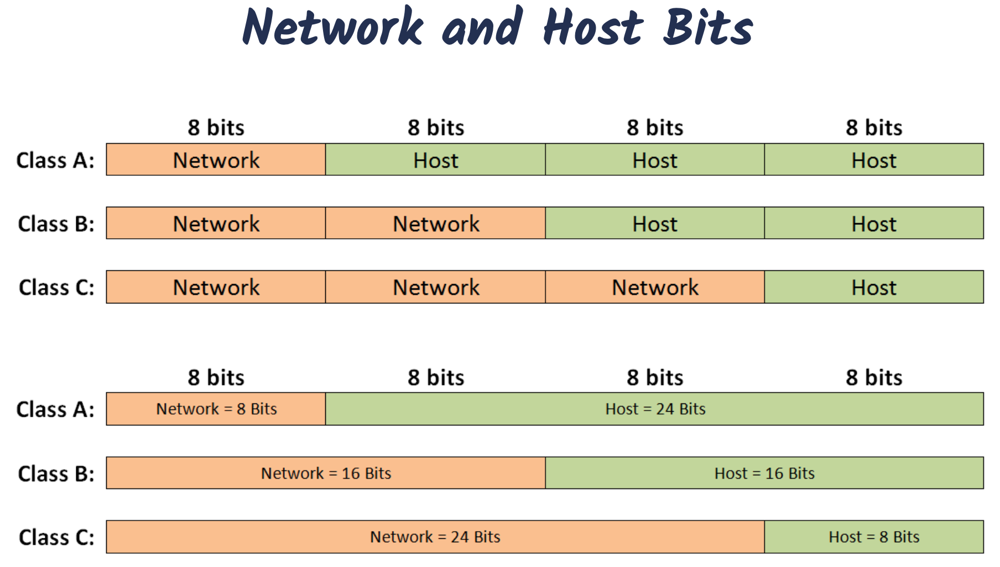
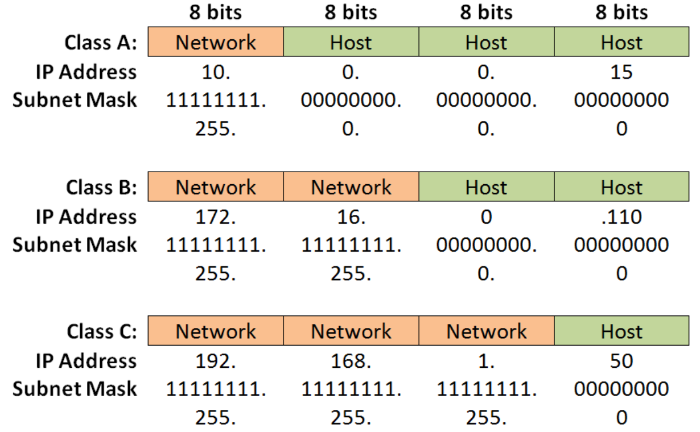
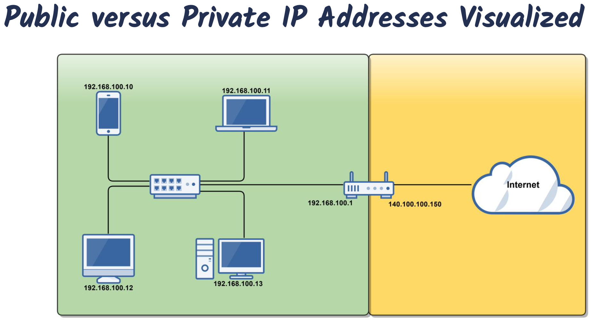

# A-Deeper-Dive-into-IPv4-Addresses-and-Subnet-Masks

## IP Address Classification and Subnet Mask

### IPv4 Address Classes(Simplified)

| Class | Network Bits | Host Bits |        Address Range        |
| :---: | :----------: | :-------: | :-------------------------: |
|   A   |      8       |    24     |  1.0.0.0 - 126.255.255.255  |
|   B   |      16      |    16     | 128.0.0.0 - 191.255.255.255 |
|   C   |      24      |     8     | 192.0.0.0 - 223.255.255.255 |

### IPv4 Address Classes(Detailed)

|     Class     |  Leading Bits  | Network Bits | Remaining Bits | Number of Networks | Hosts Per Network | Defualt Subnet Mask |
| :-----------: | :------------: | :----------: | :------------: | :----------------: | :---------------: | :-----------------: |
|       A       |   0 (1-126)    |      8       |       24       |      128(2^7)      | 16,777,216(2^24)  |      255.0.0.0      |
|       B       |  10 (128-191)  |      16      |       16       |    16,384(2^14)    |   65,536(2^16)    |     255.255.0.0     |
|       C       | 110 (192-223)  |      24      |       8        |  2,097,152(2^21)   |     256(2^8)      |    255.255.255.0    |
| D (multicast) | 1100 (224-239) | Not defined  |  Not defined   |    Not defined     |    Not defined    |     Not defined     |
| E (reserved)  | 1111 (240-255) | Not defined  |  Not defined   |    Not defined     |    Not defined    |     Not defined     |

### Defualt Subnet Masks

- The Subnet Mask tells you which portion of the IP address identifies the network and which portion identifies the host.
- Below are default Class A, B, and C Subnet Masks.

### CIDR Notation

- CIDR: Classless Inter-Domain Routing
  - A methodology for subnetting
  - "Slash" Notation tells you how many bits are associated with the Subnet Mask
- A shortcut way of telling us what the Subnet Mask is
  - /8 = 11111111.00000000.00000000.00000000
  - /8 = 255.0.0.0
- 192.168.1.0 /24 = 255.255.255.0
- 10.1.0.0 /16 = 255.255.0.0
- 196.10.10.0 /25 = 255.255.255.128

---

## Public versus Private IP Addresses

- Public IP Addresses
  - Original Design of Internet
  - "Registered" Public IP Addresses
  - Assigned by an ISP to a Business or Home
  - Must be Globally Unique
    - Web Servers
    - DNS Servers
    - Routers
  - By the early 1990s, the World was running out of public IP Addresses
  - Private IP Addresses & Network Address Translation (NAT) were Born!
- Private IP Addresses
  - "Unregistered": Free for use by anybody!
  - Designed for use within private Internet Networks
  - Cannot be used or routed on a public network
  - Utilizes NAT to "Speak" to public networks, i.e., the Internet!

### Private IP Address Ranges

| Class |       IP Address Range        | Network ID(s) (CIDR Notation)                               |          Number of Addresses           |
| :---: | :---------------------------: | :---------------------------------------------------------- | :------------------------------------: |
|   A   |   10.0.0.0 - 10.255.255.255   | 10.0.0.0 /8, 1 Private Class A Network                      | 16,777,216 IP Addresses per Network ID |
|   B   |  172.16.0.0 - 172.31.255.255  | 172.16.0.0 - 172.31.0.0 /16, 1 Private Class B Networks     |   65,634 IP Addresses per Network ID   |
|   C   | 192.168.0.0 - 192.168.255.255 | 192.168.0.0 - 192.168.255.0 /24, 1 Private Class C Networks |    254 IP Addresses per Network ID     |

---

## The Loopback IP Address

- 127.0.0.0 to 127.255.255.255 is reserved for loopback, i.e., a host's own address, also known as the localhost address.
  - 127.0.0.1 is typically configured as the default loopback address on operating systems.
- Used for diagnostics purposes to check that TCP/IP is correctly installed on a host's operating system.
  - When a process creates a packet destined to the loopback address, the operating system loops it back to itself without it ever interfacing with the NIC.
  - Data sent on the loopback is forwarded by the operating system to a virtual network interface within the operating systems.
- If you can successfully ping 127.0.0.1 or any IP within the loopback range, then TCP/IP on your computer is properly working.
  - Ping 127.0.0.1
  - Ping localhost
  - Ping loopback
