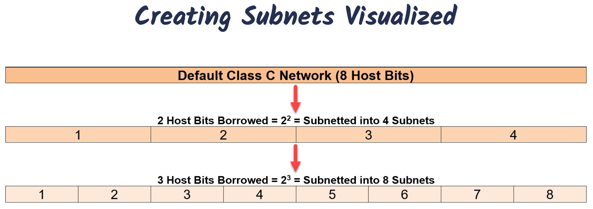

# Introduction to Subnetting

## Why Subnet?

- Using default Class A, B and C subnets (called Classful IP Addressing) is inefiicient
  - Wastes unused IP Addresses (Public IP Addresses)
- Allows you to create multiple logical networks that exist withina single Class A, B, or C network.
  - Breaks up larger networks into multiple smaller sub-networks, which are called subnets
- Allows for more efficient routing via router summarization.
- Increased network security!

### Process of Subnetting

- We borrow host bits to create more sub-networks(subnets) from a Class A, B, or C network.
- When you borrow hosts bits
  - You create additional sub-networks, i.e., subnets
  - You also decrease the amount of host IP addresses available to use.

### How to Create Subnets

- Borrow bits from the host portion of an IP address
  - Each bit we borrow is equal to 2^1 Subnets
    - Borrow 1 Host Bit = 2^1 = 2
    - Borrow 2 Host Bits = 2^2 = 4
    - Borrow 3 Host Bits = 2^3 = 8
    - Borrow 4 Host Bits = 2^4 = 16
    - Etc.

### Subnetting Questions

- To Create a Subnet, Answer the Floowing Questions
  - How may subnets are needed?
  - How may hosts do you need per subnet?

### Class C Possible Subnets

| Binary (N.N.N.H) | Decimal         | CIDR | # Subnets (2^x) | Block Size (2^y) | # Hosts (2^y - 2) |
| ---------------- | --------------- | ---- | --------------- | ---------------- | ----------------- |
| N.N.N.00000000   | 255.255.255.0   | /24  | 2^0 = 1         | 2^8 = 256        | 2^8 - 2 = 254     |
| N.N.N.10000000   | 255.255.255.128 | /25  | 2^1 = 2         | 2^7 = 128        | 2^7 - 2 = 126     |
| N.N.N.11000000   | 255.255.255.192 | /26  | 2^2 = 4         | 2^6 = 64         | 2^6 - 2 = 62      |
| N.N.N.11100000   | 255.255.255.224 | /27  | 2^3 = 8         | 2^5 = 32         | 2^5 - 2 = 30      |
| N.N.N.11110000   | 255.255.255.240 | /28  | 2^4 = 16        | 2^4 = 16         | 2^4 - 2 = 14      |
| N.N.N.11111000   | 255.255.255.248 | /29  | 2^5 = 32        | 2^3 = 8          | 2^3 - 2 = 6       |
| N.N.N.11111100   | 255.255.255.252 | /30  | 2^6 = 64        | 2^2 = 4          | 2^2 - 2 = 2       |

**Number of Subnets (2^x)**
X = number of host bits we borrow to create subnets

**Block Size (2^y)**
Y = number of remaining host bits left that are used for the subnet IP addresses

**Hosts per Subnets (2^y - 2)**
There are two addresses per network (or subnet) that we cannot use to assign to hosts on that network

- Network Address: This is the address used to uniquely identify the network(or subnet).
- Broadcast Address: Address reserved for broadcast communication on the network.
