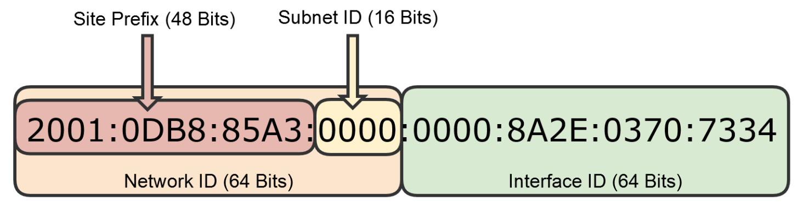

# IP Addressing Version 6

## Disadvantages of IPv4

- Not enough IPv4 Addresses
  - Approximately 4.3 billion public IP addresses
  - 7.8 billion world population
  - Multiple devices per user (computers, tablets, smart phones, smart TVs, home automation, etc.)
- Less Efficient Routing (compared to IPv6)
- Security is Optional
  - Encrypted data is optional

## IPv6 Solutions

- Plethora of Addresses
  - 128-bit binary address space compared to 32-bit for IPv4
  - 340 trillion trillion trillion addresses
  - 5 x 10^28 addresses for each person on the planet
- Simplified Internet Routing Tables
  - IPv6 packet header enables more efficient routing
    - Fixed at 40 Bytes versus IPv4 "Variable Length" Packet Header for Optional Fields
- Easier & Automated Configuration Compared to IPv4
  - Stateless Auto-Configuration
  - No need for a DHCP server
- Security is Required
  - Internet Protocol Security (IPSec) is required.
    - Source IP can be authenticated
    - Data in transit is encrypted

## IPv4 vs. Ipv6

|                     | IPv4        | IPv6      |
| ------------------- | ----------- | --------- |
| Deployed            | 1981        | 1999      |
| Address Size        | 32-Bit      | 128-Bit   |
| Number of Addresses | 2^32        | 2^128     |
| Addressing          | Class-Based | Classless |

## Why is IPv4 Still Around?

- Subnetting / CIDR
- Use of Private IP Addresses
- Network Address Translation(NAT)

---

## IPv6 Addressing

- 128-bit address composed of eight 16-bit hexadecimal blocks, separated by colons
- Each number of letter is 4 binary bits.
- They are shown in hexadecimal to simply the address
  - 128 digits in binary format
  - Up to 64 digits in decimal format.
- Example
  - Hexadecimal: 85A3
  - Binary: 1000 0101 1010 0011
  - Decimal 8 5 10 3

## The Network and Interface IDs

- 128-bit address composed of eight 160bit Hexadecimal blocks, separated by colons.
- Network ID
  - Site Prefix: Used for routing over the Internet
  - Subnet ID: Used for subnets on internal networks.
- Interface ID
  - The host portion of the adress, that's automatically configured from the MAC address or manually configured in EUI-64 format.

## IPv6 Address Simplification

- We can simplify by omitting leading 0's
  - 0DB8 -> DB8
  - 0000 -> 0
- Can also compress contiguous blocks of 0's into double colon "::" once per address.
  - :0000:0000: -> ::

## IPv6 CIDR

- We can use CIDR notation with IPv6 addresses, similar to IPv4
  - FE80::8A:0:8398:85A3/64
- This telss us
  - Network ID(64-bits): FE80:0000:0000:0000
  - Interface ID(64-biys): 008A:0000:8398:85A3
- A standard IPv6 subnet can have 2^64 IPv6 addresses
