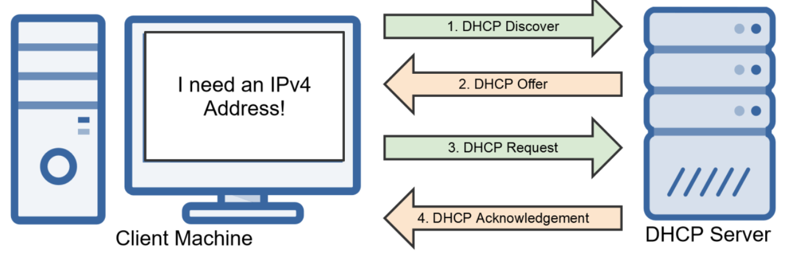
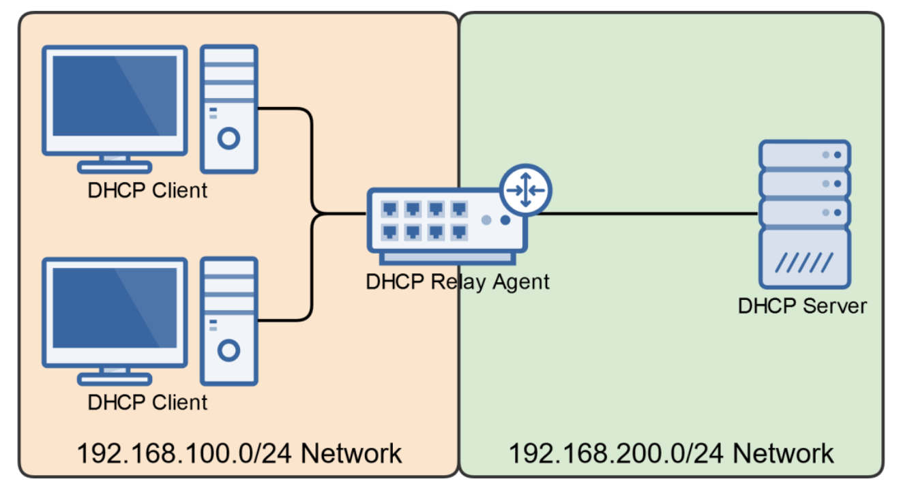

# Assigning IP Addresses

## Static versus Dynamic IP Address Assignment

- Static
  - IP Address is manually configured
  - It doesn't change
  - Commonly used
    - DNS Servers
    - Web Servers
    - Network Printers
    - Default Gateway(Router)
- Dynamic
  - IP address is dynamically configured
    - DHCP Server
    - APIPA
    - Stateless Auto-Configuration
  - Commonly used for end-user devices that don't require a static IP address.

---

## IPv4 Dynamic IP Address Assignment

- Two Methods
  - Dynamic Host Configuration Protocol (DHCP)
  - Automatic Private IP Addressing (APIPA)

### Understanding the DHCP DORA Process

1. Client requests an IP address by broadcasting a **"DHCP Discover"** message on its local subnet.
2. When the DHCP server receives the request, it'll respond with a **"DHCP Offer"** message containing an IP address and lease information.
3. If no DHCP server is available, the client will use Automatic Private IP Addressing (APIPA)
4. The client then accepts the "DHCP Offer" by replying with a **"DHCP Request"** message to the DHCP server.
5. The DHCP server assigns the client the address and sends a **"DHCP Acknowledgement"** message in response, finalizing the DHCP IP address lease.

### Additional DHCP Details

When configuring DHCP, you'll typically have the option to configure the following:

- IP Address Scope / Pool
- Default Gateway (Router)
- DNS Servers
- IP Address Exclusions
- Mac Address Reservations
- Lease Duration

### DHCP Relay Agents

- A system used to forward DHCP requests and replies between a DHCP server and clients when the DHCP server is on a different network.
- This allows you to not have to have a DHCP server on each network.

### Automatic Private IP Addressing (APIPA)

- Windows Operating System Feature
- Allows DHCP-configured clients to self-configure IP adresses if no DHCP server is available on the network.
- If a DHCP server doesn't respond to a request for an IP address, Windows OS can self-configure an APIPA IP address & subnet mask.
  - Class B IP Address Range: 169.254.0.1 - 169.254.255.254
  - Subnet Mask: 255.255.0.0
- This allows clients on the same network to assign themselves IP addresses in the 169.254.x.x range and communicate with one another.
- APIPA addresses are link-local, meaning they're not routable.
