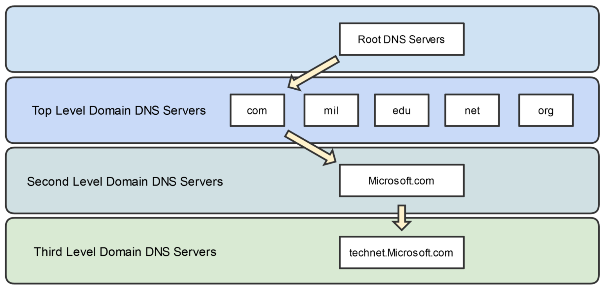

# DNS Fundamentals

## Domain Name System Overview and Hierachy

- DNS provides TCP/IP name resolution services, which is the process of translating host and domain names into their corresponding IP address(and vice versa).

## Fully Qualified Domain Names (FQND)

- An FQDN is used to uniquely identify a host on the Internet, such as my website, www.InstructorAlton.com
- Composed of three components:
  - Host Name: www
  - Domain Name: InstructorAlton.com
  - Top-Level Domain: .com

## DNS Hierarchy

---

## Common DNS Record Types

| Record Type        | Description                                                                                                            |
| ------------------ | ---------------------------------------------------------------------------------------------------------------------- |
| A (IPv4 Host)      | Resolves a domain name to an IPv4 address.                                                                             |
| AAAA (IPv6)        | Resolves a domain name to an IPv6 address.                                                                             |
| PTR (Pointer)      | Resolves an IP address to a domain name.                                                                               |
| CNAME (Alias)      | Resolves one domain anme to another domain name, allowing multiple domain anmes to be resolved to the same IP address. |
| MX (Mail Excahnge) | Used for mail exchange servers (email servers).                                                                        |
| NS (Name Server)   | Identifies DNS name servers.                                                                                           |
