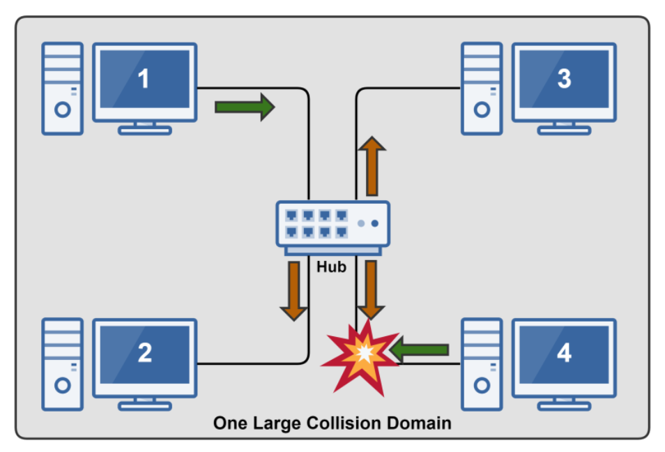
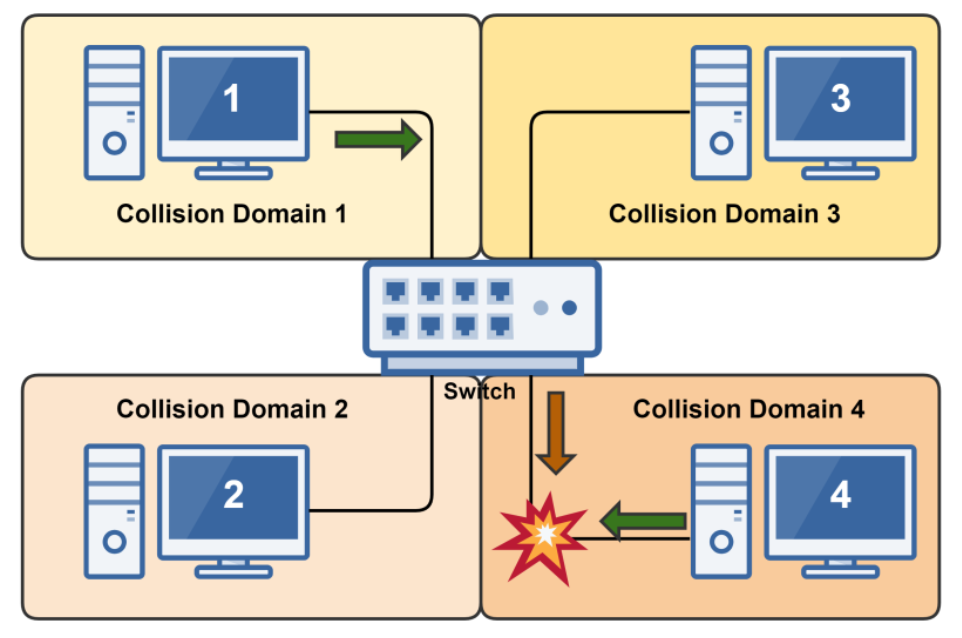
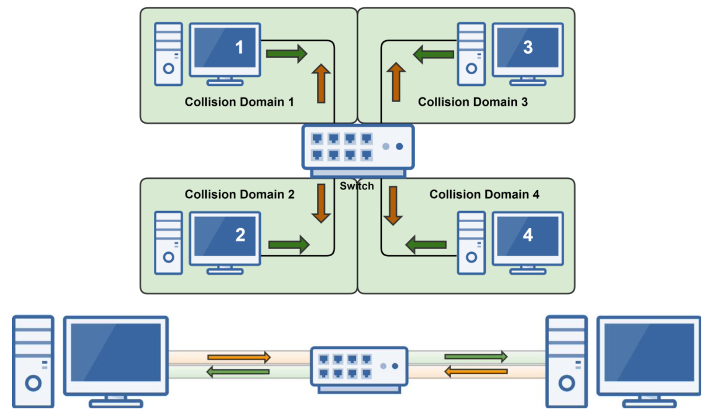
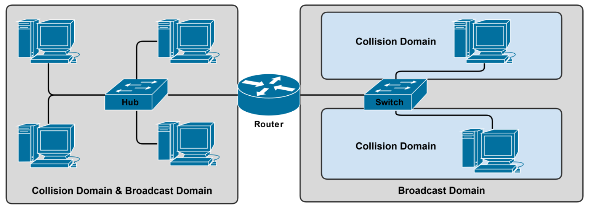
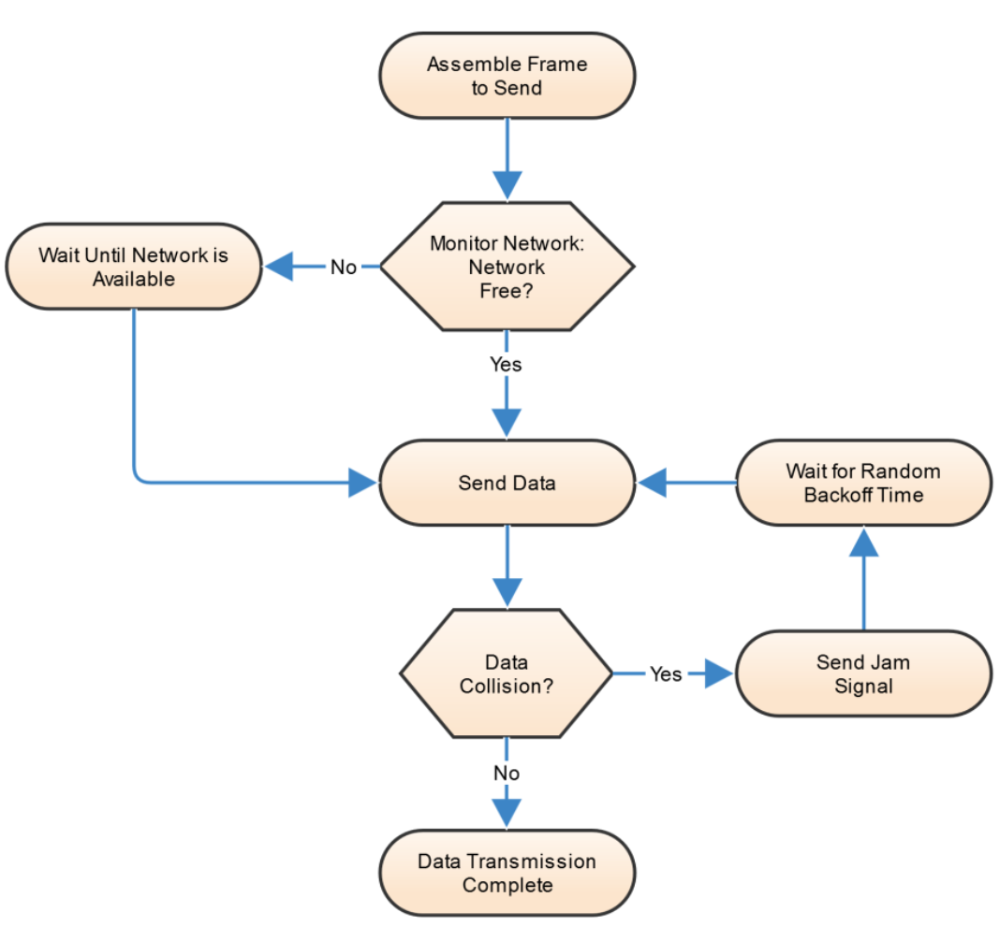
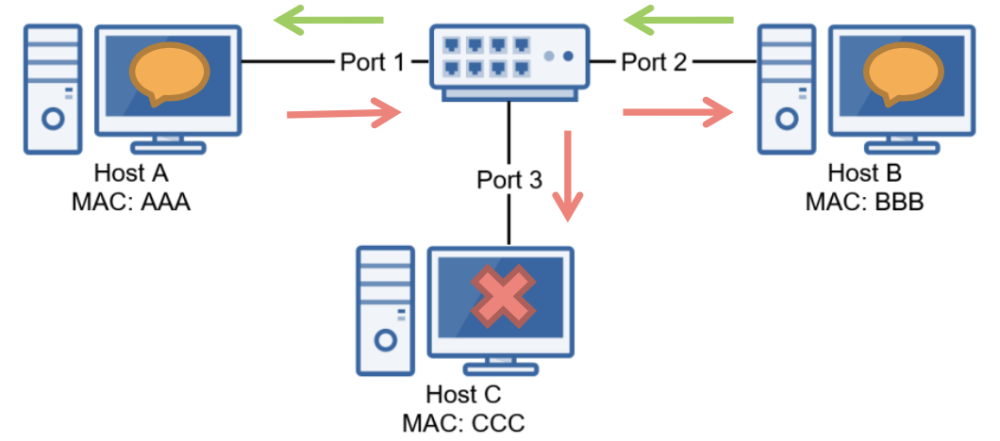
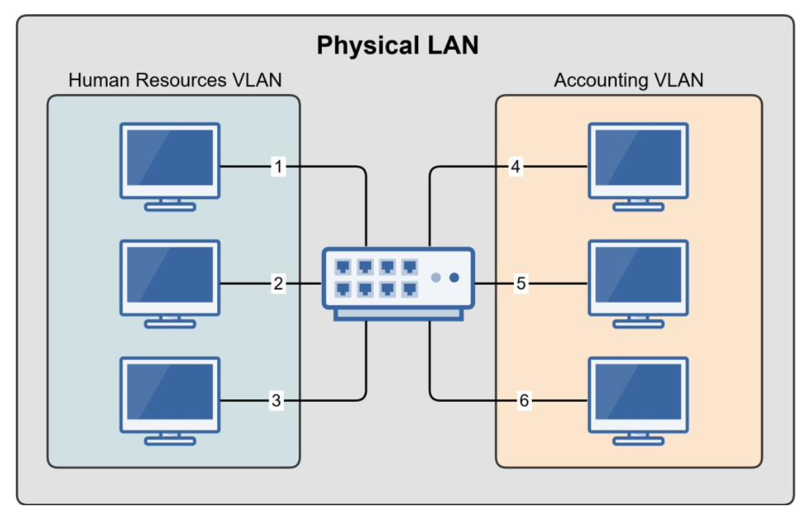
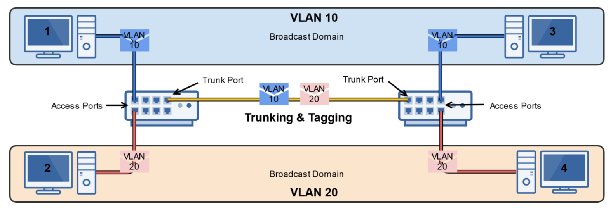

# Understanding Switches

## Refresher on Switches

- Connects devices together just like a hub
- Intelligent network device (OSI Layer 2)
- Memorizes the **MAC Address** of each device connected to it via **MAC Address Talbe**
  - Pays attention to source and destination MAC addresses during communication process.
- Breaks up collision domains
  - Traffic goes in one port and is repeated out to only destination port
  - Standard in today's network infrastructure

---

## Collision Domains

### Understanding Collision Domains

- A Collision domain is simply a network segment in which data collisions can occur.
- Collisions can occur on ethernet networks using:
  - Hubs
  - Switches in Half-Duplex Mode
- We utilize CSMA/CD to help minimize collisions
  - Carrier Sense Multiple Access with Collsion Detection

**Hubs**
Create one large collision domain.

**Switches (Half-Duplex)**
Break collision domains up into smaller ones.

### Full Duplex Switches Eliminate Collision

- Collisions don't occur on switches utilizing full duplex mode:
  - There's dedicated channel for concurrent sending and receiving data.

---

## Understanding Broadcast Domains

A broadcast domain is a network segment in which all devices on that network receive ethernet broad casts messages(one-to-all) from each other.

- Example Broadcast Protocols: ARP, DHCP

Hubs and switches forward broadcast messages; routers do not.

- Broadcast messages are very inefficient and resource-intensive.
- If routers allowed broadcasts, WAN and Internet performance would drastically decline due to boradcast storms.

---

## CSMA/CD

- Carrier Sense Multiple Access with Collsion Detection
- Used ona shared network meduim to help reduce data collisions.
- Helps hosts decide when to send data and also detect collisions
- Used with hubs(multi-port repeaters)
- Used with switches ONLY in half-duplex mode.

**CSMA/CD Process**

---

## Unmanaged vs. Managed switches

### Unmanaged

- Completely unmanaged.
- Unbox it, plug it in, and it works without any administration.

### Managed

- Can be configured and managed by network administrators, typically via Telnet or SSH.
  - Configure static entries in the MAC table.
  - Configure half or full-duplex on specific ports.
  - Monitor switch performance with SNMP.
  - Create virtual LANs(VLANs)
  - Configure Port Mirroring
- Much more expensive than unmanaged switches.

---

## How a Switch Learns MAC Addresses

The Switch Learning Process

1. Host A sends Ethernet frame to Host B
   - Source: AAA, Destination: BBB
2. Switch records that Host A's MAC address is on Port 1 in its MAC Address Table.
3. Switch doesn't know what port Host B is using, so it will flood ports 2 and 3(broadcast).
4. Hosts B & C will examine the Ethernet frame. Host C will discard it and Host B will respond to Host A.
   - Source: BBB, Destination: AAA.
5. When Host B responds, the switch will record Host B's MAC address on Port 2.
6. The switch already knows that Host A is on Port 1, so it will forward the Ethernet frame to Port 1.

Switch MAC Address Table

| Port Number | MAC Address |
| ----------- | ----------- |
| 1           | AAA         |
| 2           | BBB         |

---

## Virtual LANs(VLANs)

- Essentially LANs within a LAN
  - Physical Switch -> Multiple Virtual Switches
- Break up a large "physical LAN into several smaller "logical" LANs.
- Accomplished with managed switches.
- Assign specific switch interfaces(ports) to specific virtual LANs.
  - Human Resource VLAN (Interface 1,2,3)
  - Accounting VLAN (Interface 4,5,6)
- Benefits of VLANs
  - Reduces Broadcast Domains
  - Segments Network by Role
  - Increases Security
  - Devices cannot communicate with other VLANs.
  - Group devices by need, not physical location

### VLANs with Multiple Switches

- Truck Ports
  - Creates a connection between two switches(trunk link) for VLAN traffic to traverse for multiple VLANs.
- Access Ports
  - Ports configured for use for a single VLAN.
- Tagging (802.1Q)
  - Ethernet frames are tagged with their respective VLAN ID when traversing trunk ports to ensure proper delivery.
- Untagged Frames
  - If a frame isn't tagged with a VLAN ID, siwtch trunk ports can be configured with a native VLAN, to which the untagged frame will be sent.
