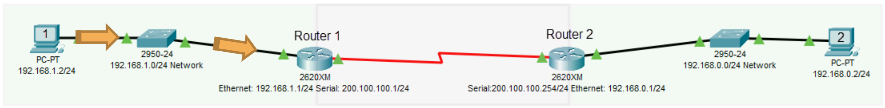

# Understanding Routers

## Refresher on Routers

- Used to connect different networks together
- Routes traffic between networks using IP Addresses
- Uses intelligent decisions (Routing Protocols) to find the best way to get a packet of information from one network to another.
- Break up broadcast domains
- OSI Layer 3 Device
  - Layer 3 = Router
  - Layer 2 = Switch
  - Layer 1 = Hub

---

## Step 1: The Routing Process (Simplified)

- PC 1 creates a packet destined for PC 2
  - Source IP: 192.168.1.2/24
  - Destination IP: 192.168.0.2/24
- Because it is destined for another network, it is sent to PC 1's default gateway, which is the Ethernet interface of Router 1 (192.168.1.1/24)
- If PC 1 doesn't know router 1's MAC Address, PC 1 will send out an ARP request.

## Step 2: The Routing Process (Simplified)

- Once Router 1 receives the packet, it'll inspect its destinatio IP address and then make a routing decision based on its routing table to identify which route to send it to.
- In this case, it's Router 1's serial interface with an IP address of 200.100.100.1/24.

## Step 3: The Routing Process (Simplified)

- Once Router 2 receives the packet, it'll inspect its destination IP address and then make a routing decision based on its routing table to identify which route to send it to.
- In this case, it's its directly connected Ethernet interface with an IP address of 192.168.0.1./24.
