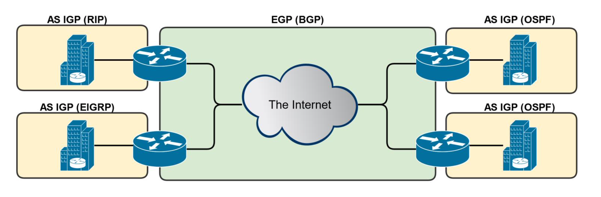

# Understanding Routers

## Refresher on Routers

- Used to connect different networks together
- Routes traffic between networks using IP Addresses
- Uses intelligent decisions (Routing Protocols) to find the best way to get a packet of information from one network to another.
- Break up broadcast domains
- OSI Layer 3 Device
  - Layer 3 = Router
  - Layer 2 = Switch
  - Layer 1 = Hub

---

## Step 1: The Routing Process (Simplified)

- PC 1 creates a packet destined for PC 2
  - Source IP: 192.168.1.2/24
  - Destination IP: 192.168.0.2/24
- Because it is destined for another network, it is sent to PC 1's default gateway, which is the Ethernet interface of Router 1 (192.168.1.1/24)
- If PC 1 doesn't know router 1's MAC Address, PC 1 will send out an ARP request.

## Step 2: The Routing Process (Simplified)

- Once Router 1 receives the packet, it'll inspect its destinatio IP address and then make a routing decision based on its routing table to identify which route to send it to.
- In this case, it's Router 1's serial interface with an IP address of 200.100.100.1/24.

## Step 3: The Routing Process (Simplified)

- Once Router 2 receives the packet, it'll inspect its destination IP address and then make a routing decision based on its routing table to identify which route to send it to.
- In this case, it's its directly connected Ethernet interface with an IP address of 192.168.0.1./24.

---

## Static vs. Dynamic Routing

### Static Routing

- The simplest form of routing
- Static routes that are manually entered by a network administrator
- Ideal for small networks with very few routes that rarely change
  - There's no overhead like there is with dynamic routing.
- Can be problematic for larger networks or if the network regularly changes
  - All changes must be made manually, which is time-consuming and can be error-prone

### Dynamic Routing

- An automated form of routing that uses routing protocols to:
  - Populate router's routing table
  - Make the most efficient routing decision
  - Updating the routing table whenever the network changes
- Automatic & Hands-Off
  - All routing decisions are handled by the protocol
- Ideal for larger, and more complex networks

### Types of Dynamic Routing Protocols

- Thre are three different types of dynamic routing protocols, which we'll discuss in detail later in this section
- Dynamic
  - Distance-Vector
  - Link-State
  - Hybrid

---

## AS (Autonomous System)

- Autonomous = Independent Entity (Organization)
  - University, Corporation, Governmental Agency
- Routers are usually part of an Autonomous System (AS)
  - IP routes under common control
- An AS is a connected group of one or more IP prefixes run by one or more network operators with a signle and clearly defined routing policy (Single Organization)
- Important point of reference for discussing Interior Gateway Protocols (IGP) and Exterior Gateway Protocols (EGP)

### IGP (Interior Gateway Protocol)

- Used within a single AS (Your Organization)
  - Not intended to route between Autonomous Systems
    - That's why there's Exterior Gateway Protocols(EGPs)
- IGP Protocols
  - RIP (Routing Information Protocol)
  - OSPF (Open Shortest Path First)
  - EIGRP (Enhanced Interior Gateway Routing Protocol)

### EGP (Exterior Gateway Protocol)

- Used to route between Autonomous Systems
  - Internet Service Providers(ISPs)
- BGP (Border Gateway Protocol)
  - Almost all ISPs uses BGP as their EGP

**EGP & IGPs Working Together**

