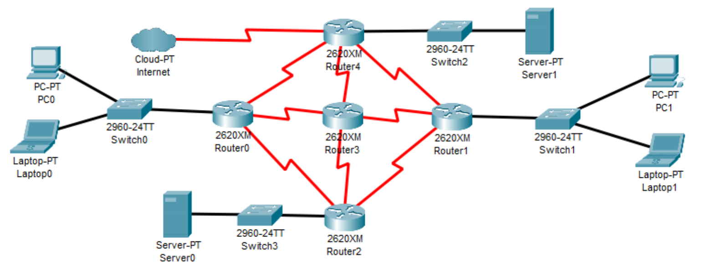
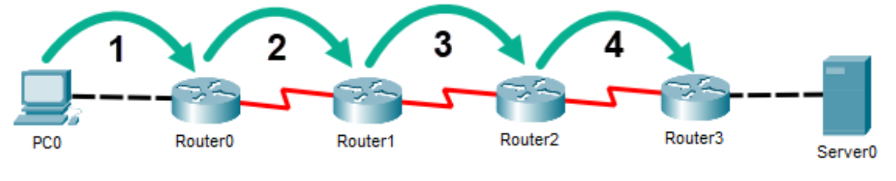
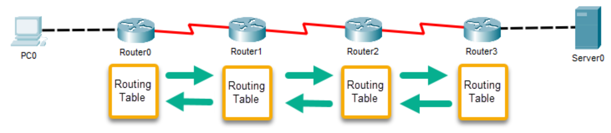

# Understanding Routers

## Refresher on Routers

- Used to connect different networks together
- Routes traffic between networks using IP Addresses
- Uses intelligent decisions (Routing Protocols) to find the best way to get a packet of information from one network to another.
- Break up broadcast domains
- OSI Layer 3 Device
  - Layer 3 = Router
  - Layer 2 = Switch
  - Layer 1 = Hub

---

## Step 1: The Routing Process (Simplified)

- PC 1 creates a packet destined for PC 2
  - Source IP: 192.168.1.2/24
  - Destination IP: 192.168.0.2/24
- Because it is destined for another network, it is sent to PC 1's default gateway, which is the Ethernet interface of Router 1 (192.168.1.1/24)
- If PC 1 doesn't know router 1's MAC Address, PC 1 will send out an ARP request.

## Step 2: The Routing Process (Simplified)

- Once Router 1 receives the packet, it'll inspect its destinatio IP address and then make a routing decision based on its routing table to identify which route to send it to.
- In this case, it's Router 1's serial interface with an IP address of 200.100.100.1/24.

## Step 3: The Routing Process (Simplified)

- Once Router 2 receives the packet, it'll inspect its destination IP address and then make a routing decision based on its routing table to identify which route to send it to.
- In this case, it's its directly connected Ethernet interface with an IP address of 192.168.0.1./24.

---

## Static vs. Dynamic Routing

### Static Routing

- The simplest form of routing
- Static routes that are manually entered by a network administrator
- Ideal for small networks with very few routes that rarely change
  - There's no overhead like there is with dynamic routing.
- Can be problematic for larger networks or if the network regularly changes
  - All changes must be made manually, which is time-consuming and can be error-prone

### Dynamic Routing

- An automated form of routing that uses routing protocols to:
  - Populate router's routing table
  - Make the most efficient routing decision
  - Updating the routing table whenever the network changes
- Automatic & Hands-Off
  - All routing decisions are handled by the protocol
- Ideal for larger, and more complex networks

### Types of Dynamic Routing Protocols

- Thre are three different types of dynamic routing protocols, which we'll discuss in detail later in this section
- Dynamic
  - Distance-Vector
  - Link-State
  - Hybrid

---

## AS (Autonomous System)

- Autonomous = Independent Entity (Organization)
  - University, Corporation, Governmental Agency
- Routers are usually part of an Autonomous System (AS)
  - IP routes under common control
- An AS is a connected group of one or more IP prefixes run by one or more network operators with a signle and clearly defined routing policy (Single Organization)
- Important point of reference for discussing Interior Gateway Protocols (IGP) and Exterior Gateway Protocols (EGP)

### IGP (Interior Gateway Protocol)

- Used within a single AS (Your Organization)
  - Not intended to route between Autonomous Systems
    - That's why there's Exterior Gateway Protocols(EGPs)
- IGP Protocols
  - RIP (Routing Information Protocol)
  - OSPF (Open Shortest Path First)
  - EIGRP (Enhanced Interior Gateway Routing Protocol)

### EGP (Exterior Gateway Protocol)

- Used to route between Autonomous Systems
  - Internet Service Providers(ISPs)
- BGP (Border Gateway Protocol)
  - Almost all ISPs uses BGP as their EGP

**EGP & IGPs Working Together**

---

## Interior Gateway Protocols

- There are three different types of IGPs:
  - Distance-Vector
    - RIP
    - EIGRP
  - Link State
    - OSPF

### Distance-Vector

- Like its name implies, Distance-Vector routing protocols use distance as their metric for making routing decisions.
  - Distance = Hop Count
  - Hops are the number of routers that a packet passes through from its source to its destination.
    
- Distance-Vector Routing Protocols:
  - Router Information Protocol (RIP)
  - Enhanced Interior Gateway Routing Protocol (EIGRP)

### Router-Information Protocol (RIP)

- A long-established distance-vector protocol with three versions.
- Supports a maximum of 15 hops to prevent routing loops
  - Doesn't scale well due to 15 hop limitation.
- Sends a full copy of its routing table to directly connected routers every 30 seconds
  - Slow network onvergence times, which can lead to potential routing loop issues
  - For example: router 3 may need to wait up to 90 seconds to get router 0's full routing table
  - Lead to unnecessary network traffic and high router CPU utilization.
    

### Enhanced Interior Gateway Routing Protocol (EIGRP)

- A Cisco propretary routing protocol that only works on Cisco routers.
- Not a true distance-vector routing protocol
  - Utilizes hop count metrics, but also reliability, bandwidth, load, and delay metrics.
  - Can be considered an advanced distance-vector or hybrid routing protocol
- Has a default hop count of 100 and maximum of 255
- Supports classless routing and VLSM
- Very fast converging and very scalable for larger networks

### Link-State

- Link-state routing protocols build a map of the entire network.
- Utilize link-state advertisements(LSAs) to acoomplish this:
  - Routers share information with all other routers on the network via LSAs.
  - This allows them to build a complete network map.
- Once the network map is built, routers only update each other when there is a change to the network.
- Otherwise, they don't communicate, except with a periodic "hello" packet, so the other routers know they are up and functioning.
- This leads to faster network convergence times that support larger networks.
- Link-State Routing Protocol:
  - Open Shortest Path First (OSPF)

#### Open Shortest Path First (OSPF)

- Open standard link-state routing protocol
- Well suited for large networks with multiple redundant paths.
- It builds a toplological routing tree, call a shrtest-path tree.
- Sub-dividees a larger network into areas where routers share information with other routers in their designated area:
  - Minimizes routing update traffic and improves network convergence times
- Uses "cost" metrics to determine the "best" route by including link state and speed.
- Supports classless addressing and VLSM
- Has an unlimited hop count

---

## Border Gateway Protocol (BGP)

- The only EGP in widespread use today
- Considered the Internet's core routing protocol
  - Supports IPv4 and IPv6
  - Highly Scalable
- Often called a path-vector (hybrid) routing protocol
  - Each ISP is assigned a unique Autonomous System (AS) number
  - Uses the number of AS hops rather than individual router hops as its metric
- Utilizes the BGP Best Path Selection algorithm to identify the bestroute
- Routing protocol from AS to AS
  - When you connect to the Internet, you're moving from one AS to another

---

## Routing Table Entries

- Routing table categories:
  - Directly Connected Routes
    - Networks that are directly connected to the router.
  - Remote Network Routes
    - Networks that aren't directly connected to the router.
  - Default Routes
    - Routes when no match is found in the routing table.

### Routing Table Compenents

- Routing tables, at a minimum, will include the following information:
  - Type
  - Destination Network ID & Subnet Mask
  - Router Interface
  - Metric

| Type      | Network          | Interface       | Metric |
| --------- | ---------------- | --------------- | ------ |
| Connected | 192.168.1.0/24   | FastEthernet0/0 | 0      |
| Connected | 200.100.100.0/24 | Serial0/0       | 0      |
| Static    | 192.168.0.0/24   | Serial0/0       | 1      |
| Static    | 0.0.0.0/0        | Serial0/0       | 1      |

### Administrative Distance (AD)

- Routers use Administrative distance (AD) to rate the overall trustworthiness of a route.
- AD's can have a value ranging from 0 to 255, where lower is better, based on the type of route.
- If a router receives routing table updates from two different sources, it'll utilize the one with the lower AD.

| Type                | Default AD |
| ------------------- | ---------- |
| Connected Interface | 0          |
| Static Route        | 1          |
| EIGRP               | 90         |
| OSPF                | 110        |
| RIP                 | 170        |
| Unknown             | 255        |

---

### The Default Route

- A static route that's utilized when a packet's destination IP address has no known match in a router's routing table.
- If there's no match -> forward the packet on via the default route.
- Commonly called the gateway of last resort.
- The following addresses are used to represent the default route in a routing table:
  - IPv4: 0.0.0.0/0
  - IPv6: ::/0
