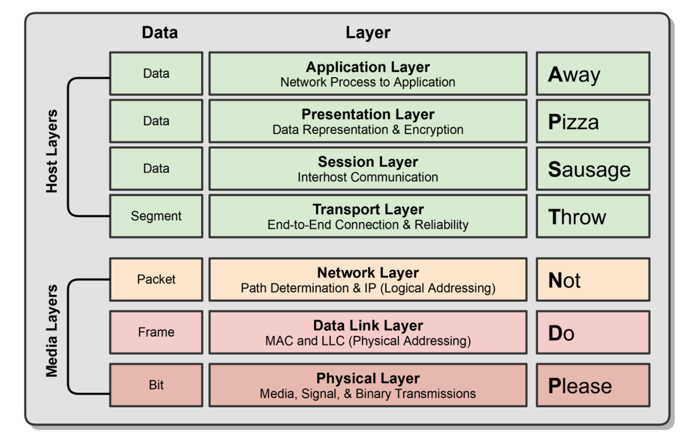
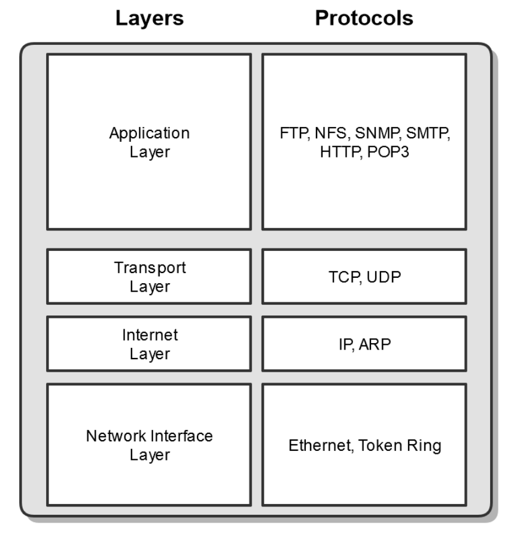
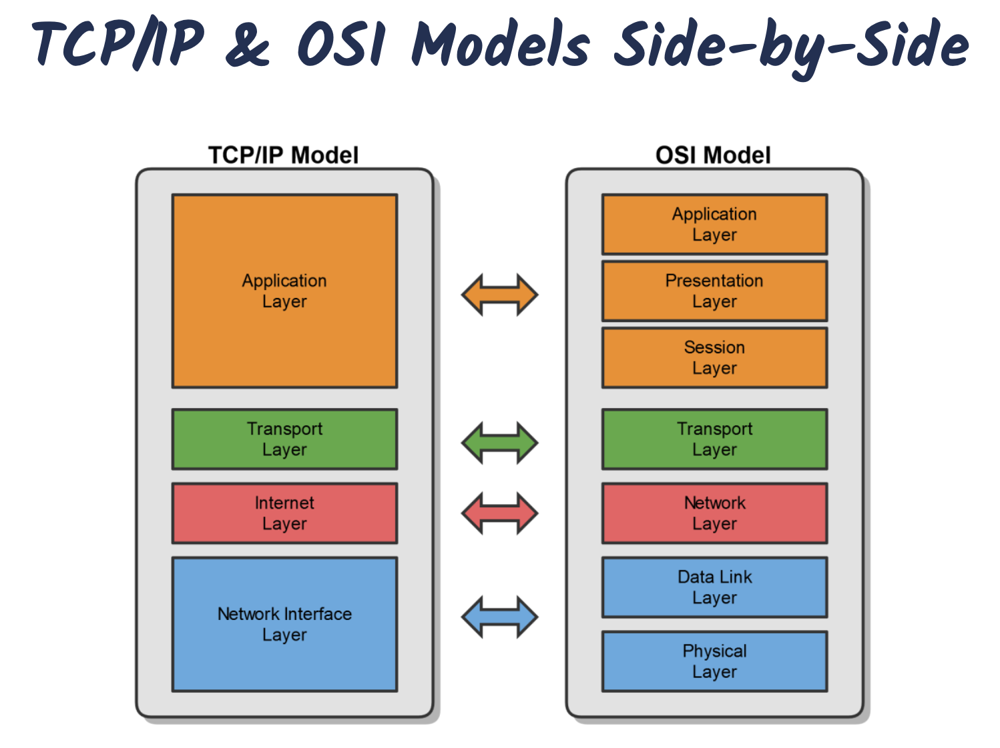

# How Computer Networks Work

## Computer Networking Protocols

Computers communicate with each other with network protocols. Protocols are rules governing how machines exchange data and enable effective communication.

- Examples
  - When you call somebody, you pick up the phone, ensure there is a dial tone, and if there is, you dial the number.
  - When you drive your car, you obey the rules of the road.

**Physical Protocols**
Describe the medium(wiring), the connections(RJ-45 port), and the signal(voltage level ona wire).

**Logical Protocols**
Software controlling how and when data is sent and received to computers, supporting physical protocols.

Computer networks depend on many different types of protocols in order to work properly.

- Example Common TCP/IP Suite of Protocols
  - Web communication: HTTP
  - E-mail: POP3, SMTP, IMAP
  - File Transfers: FTP

---

## The OSI Model

The Open Systems Interconnection(OSI) Reference Model

- A conceptual framework showing us how data moves throughout a network.
- Give us a guide to understand how networks operate.
- It is not implemented in the real world, TCP/IP is.

## OSI Model Stack

The OSI Model breaks down the complex task of computer-to-computer network communications into 7 layers.

**Upper Layers(Host Layers)**
Handled by the host computer and performs application-specific functions, such as data formatting, encryption, and connection management.

**Lower Layers(Media Layers)**
Provide network-specific functions, such as routing, addressing, and flow control.

## The TCP/IP Model

- The TCP/IP uite is the most common used protocol suite in which the Internet was built.
- It is essentially the protocol suite in which the Internet was built.
- It is the standard for computer networking.
- It is based ona 4-layer model that is similar to the OSI model.

## TCP/IP vs. OSI Models

---

## MAC Addresses

**Media Access Control(MAC)**
Physical address of the network adapter card

- OSI Layer 2 (Data Link) Layer Address
- TCP/IP Layer 1 (Network Interface) Layer Address
- Six bytes (48 bits), Usually Represented Hexadecimal
  - First three bytes (24bits) are assigned by the IEEE to the manufacturer
    - Organizationally Unique Identifier(OUI) assigned by IEEE(ex: Dell or HP)
  - Last three bytes (24 bits) are usually assigned sequentially
    - Unique Numbers
- 2^24 = 16.7 Million Unique Addresses

## IP Addresses

An IP Address is a logical address used in order to uniquely identify a device on an IP network.

- It's a Network Layer address, associated with routing.
  - OSI Layer 3: Network Layer
  - TCP/IP Layer 2: internet Layer
- There are two vversions
  - IP version 4 (IPv4)
    - Example: 192.168.0.1
  - IP version 6 (IPv6)
    - Example: 2001:DB8:85A3:0:0:8A2E:370:7334

## Comparing IP and MAC Addresses

IP Addresses

- Network (OSI Layer 3) Addresses
- Logical Addresses
- Assigned in Operating System
- Allows network-to-network communication via routers
- WAN communication

MAC Addresses

- Data Link (OSI Layer 2) Addresses
- Physical Addresses
- Physical burned on NIC (Network Inteface Card)
- Allows internetwork communication via hubs, switches, and routers
- LAN communication

---

## Half vs. Full Duplex Communication

Network communication will occur in either full or half duplex mode

- Half Duplex: Can send and receive data, but not at the same time
- Full Duplex: Can send and receive data simultaneously

## Network Transmission Types

- Unicast (One to One)
- Multicast (One to Many)
- Broadcast (One to All)

---

## Introduction to Ethernet

- The most popular networking technology in the world!
- Refers to a family of standards that define the physical and logical aspects of the world's most popular type of LAN
- The standard communications protocol for building a local area network (LAN).

**Physical**
Cabling, Connectors, Equipment, etc.

**Logical**
Network Access Method, i.e., Carrier Sense Multiple Access (CSMA)
