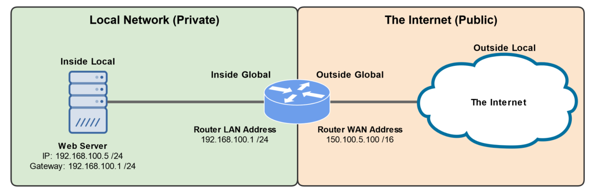
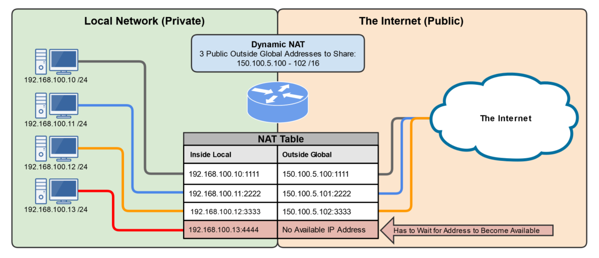
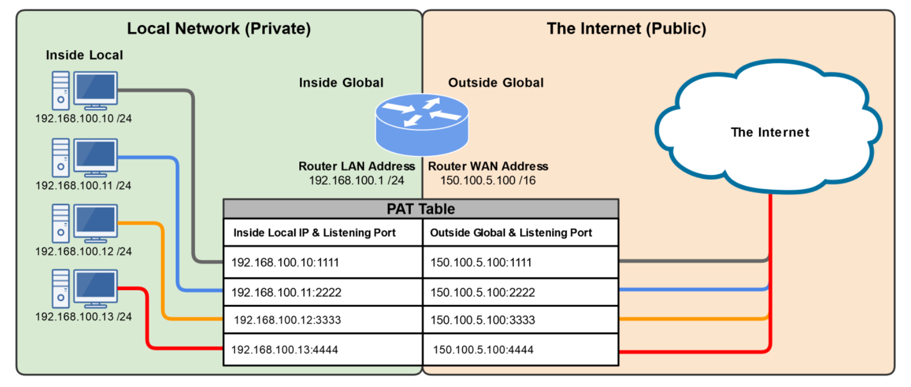
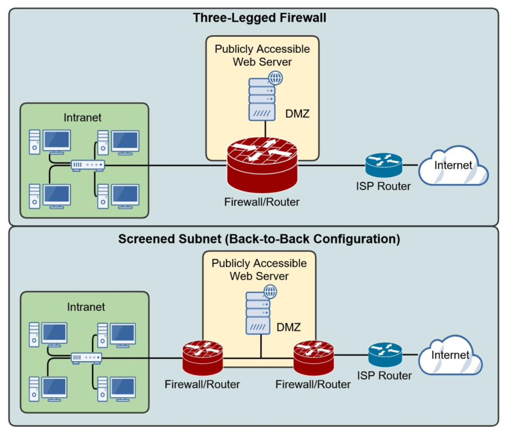
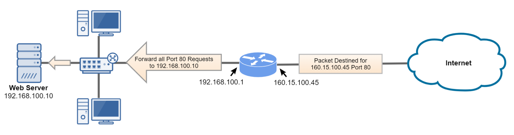

# Network Segmentation

## Network Address Translation (NAT)

- NAT translates private IP addresses to public IP addresses, allowing us to map private IP addresses to public IP addresses:
  - To help perserver scarce public IPv4 addresses
  - To help increase network security
- With NAT, the private IP address of a network device is hidden from devices outside of its LAN.
- Three are three forms of NAT:
  - Static NAT (SNAT)
  - Dynamic NAT (DNAT)
  - Port Address Tranlation (PAT)
- Border network devices, such as routers, proxy servers, and firewalls can utilize NAT.

## Static NAT (SNAT)

- One-to-One relatioinship, where one private IP is statically configured to one public IP address.
- Commonly used as a means to "hide" the IP address of a publicly available device, such as a web server.

## Dynamic NAT (DNAT)

- Many-to-Many relatioinship, where many private IP addresses have access to a pool of public IP addresses.
- If the pool of IP addresses is all in-use, other devices in the local private network must wait for them to become available.

- Many-to-One relatioinship, where all devices on the local private network utilize a single public IP addresses.
- Ports are used to link each connection to a specific dynamic port number.
- Very common in small business and home networks.

---

## Demilitarized Zone (DMZ)

- A perimeter network designed to be securely separated from an organization's private internal network (intranet).
- Commonly called a DMZ
- Allows untrusted users outside an organization's LAN (intranet) to access specific services located within the DMZ.
  - Public Web Site(s)
  - Trivial FTP Server for File Downloads (drivers, softwre, etc.)
  - Public Email Service (Gamil, etc.)
- Also blocks such users from gaining access to the organization's intranet.

## Port Forwarding

- A technique used to allow external devices access to computer services within a private network.
  - Example: Web server in your home network.
- Map an external IP address port number to a specific internal IP address and port number.
  - Example: Forward all port 80 requests to your public router IP address to your web server in your home network.
