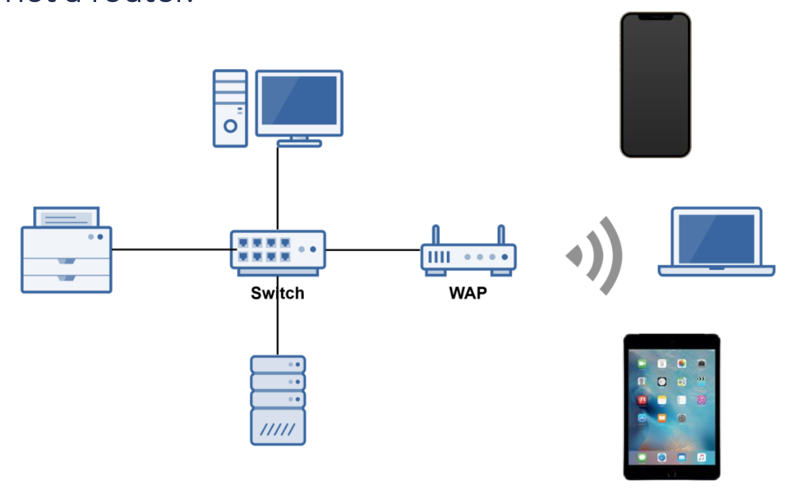

# Wireless Networking and IoT

## Overview of Wireless Networking

- IEEE 802.11: Standard for Wireless Networking
  - Been updated over the last 20 years with numerous improved 802.11 standards:
    - 802.11a
    - 802.11b
    - 802.11g
    - 802.11n
    - 802.11ac
- Wireless LANs (WLANs) use radio frequencies (RFs) that are radiated into the air from an antenna that creates radio waves.
- Can extend the connection of a wired network, used to connect entire local area networks or connect different networks together.

### Depicting Wireless Networks

### Wireless Access Point (WAP)

- A Wireless Access Point (WAP) is a bridge that extends the wired network to the wireless network.
- Just like a switch and a wired bridge, it's a Data Link Layer 2 device.
- Note: A WAP is not a router.

### Antennas

- Antenna strength measured in dBi. The higher the dBi, the further distance the signal will travel.

### Service Set Identifier (SSID)

- All wireless networks have a Service Set Identifier (SSID) in infrastructure mode.
- The SSID is the wireless network's name.
- Wireless access points broadcast a wireless network's SSID. so it is viewable by devices with a wireless network adapter.
- For network security reasons, SSID broadcasting can be disabled.

### CSMA/CA

- CSMA/CA: Carrier Sense Multiple Access with Collision Avoidance
- While wired Ethernet networks use CSMA/CD, wireless Ethernet networks use CSMA/CA.
- With wireless networks, it's more difficult to detect collisions, so CSMA/CA tries to avoid them with RTS and CTS:
  - Request to Send (RTS)
  - Clear to Send (CTS)

