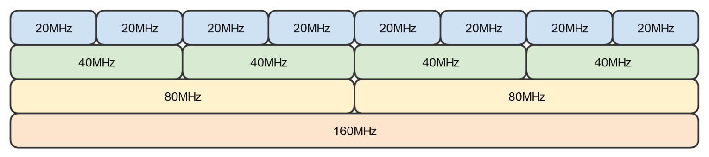

# Wireless Networking and IoT

## Overview of Wireless Networking

- IEEE 802.11: Standard for Wireless Networking
  - Been updated over the last 20 years with numerous improved 802.11 standards:
    - 802.11a
    - 802.11b
    - 802.11g
    - 802.11n
    - 802.11ac
- Wireless LANs (WLANs) use radio frequencies (RFs) that are radiated into the air from an antenna that creates radio waves.
- Can extend the connection of a wired network, used to connect entire local area networks or connect different networks together.

### Depicting Wireless Networks

### Wireless Access Point (WAP)

- A Wireless Access Point (WAP) is a bridge that extends the wired network to the wireless network.
- Just like a switch and a wired bridge, it's a Data Link Layer 2 device.
- Note: A WAP is not a router.

### Antennas

- Antenna strength measured in dBi. The higher the dBi, the further distance the signal will travel.

### Service Set Identifier (SSID)

- All wireless networks have a Service Set Identifier (SSID) in infrastructure mode.
- The SSID is the wireless network's name.
- Wireless access points broadcast a wireless network's SSID. so it is viewable by devices with a wireless network adapter.
- For network security reasons, SSID broadcasting can be disabled.

### CSMA/CA

- CSMA/CA: Carrier Sense Multiple Access with Collision Avoidance
- While wired Ethernet networks use CSMA/CD, wireless Ethernet networks use CSMA/CA.
- With wireless networks, it's more difficult to detect collisions, so CSMA/CA tries to avoid them with RTS and CTS:
  - Request to Send (RTS)
  - Clear to Send (CTS)

---

## Understanding Service Set Types

### Service Set Types

- There are three service types:
  - Independent Basic Service Set (IBSS)
  - Basic Service Set (BSS)
  - Extended Service Set (ESS)

### Ad hoc Mode: Independent Basic Service Set (IBSS)

- Peer-to-peer (P2P) wireless network shere no wireless access point (WAP) infrastructure exists.
- The devices communicate directly with one another.
- Personal area networks (PANs) are a common example of Ad hoc wireless networks.

### infrastructure Mode

Basic Service Set (BSS)

- Single Wireless Access Point (WAP)
- Most common configuration

Extended Service Set (ESS)

- Multiple WAPs, utilizing the same SSID
- Allows wireless users to seamlessly "roam" from one WAP to another.

---

## Wireless Frequencies and Channels

### Understanding Wireless Frequencies

- Wireless signals occuoy a spectrum of frequencies:
  - Signals that vibrate slowly have a low frequency.
  - Signals that vibrate quickly have a high frequency.
- For example:
  - AM Radio: 10MHz
  - FM Radio: 100MHz
  - Microwave Oven: 2.4GHz
  - Cordless Phone: 2.4GHz
- 802.11 Wireless operates at either 2.4Ghz or 5GHz

### Understanding Wireless Channels

- 802.11 Wi-Fi communication also operates on a channel, which is a portion of the 2.4GHz or 5GHz spectrum.
- 2.4GHz Band
  - Compsed of 14 overlapping 20MHz channels. Due to licensing laws:
    - Only channels 1 through 11 available in the United States.
    - Most other countries allow channels 12 and 13.
    - Channel 14 is only available in Japan.
  - It's recommended to use channels 1, 6 or 11 because they do not overlap.
    - There are just 3 non-overlapping channels.
    - 
- 5GHz Band
  - 5GHz offers significantly more channels than 2.4GHz.
  - There are roughly 40 different non-overlapping 20MHz channels.
  - Different countries have widely different rules for which channels can be used.
    - 24 non-overlapping channels available in North America.
    - 802.11 features 5GHz auto-channel switching.

### Understanding Channel Bandwidth

- The width of a channel is a channel's Bandwidth
- Expressed in MHz but equates to how many vits can be transmitted per second.
- The larger the channel bandwidth, the faster the data throughput.
- In 802.11, channel bandwidth varies from 20MHz up to 160MHz

### Understanding Channel Bonding

- 802.11 provides a channel bonding feature:
  - When two adfacent channels are combined (bonded together) to increase bandwidth.
  - When channels are bonded together, their bandwidths doubles.
  - 20MH channels can be bonded to 40MHz, 80MHz, or 160MHz Channels

### 2.4GHz versus 5GHz

- 2.4GHz Frequency Band
  - Longer Frequency Waves
    - Prorogates through solid surfaces well
    - Good solution for long-distances
    - Slower data rates
  - Lower data rates over longer distances
  - Fewer Channels
    - 3 non-overlapping channels
  - Suffers from frequency congestion & interference
    - Microwaves, cordless phones, and Bluetooth operate at 2.4GHz
- 5GHz Frequency Band
  - Shorter Frequency Waves
    - Less effective penetrating solid surfaces
    - Not as effective over long-distances
    - Faster data rates
  - Higher data rates over shorter distances
  - More Channels
    - 24 non-overlapping channels
    - Channel bonding available
  - Less congested than 2.4 GHz frequency
    - Frequency congestion and interference isn't a big issue.

---

## 802.11 Standards and MIMO

### 802.11 Standards

|                                   | 802.11 | 802.11a | 802.11b | 802.11g | 802.11n       | 802.11ac        | 802.11ax         |
| --------------------------------- | ------ | ------- | ------- | ------- | ------------- | --------------- | ---------------- |
| Date                              | 1997   | 1999    | 1999    | 2003    | 2009          | 2014            | 2019             |
| Frequency Band                    | 2.4GHz | 5GHz    | 2.4GHz  | 2.4GHz  | 2.4GHz & 5GHz | 5GHz            | 2.4GHz & 5GHz    |
| Channel Bandwidth                 | 20MHz  | 20MHz   | 20MHz   | 20MHz   | 20/40MHz      | 20/40/80/160MHz | 20/40/80/160MHz  |
| Max Theoretical Rate              | 2Mbps  | 54Mbps  | 11Mbps  | 54Mbps  | 150Mbps       | 866Mbps         | 600Mbps          |
| MIMO & Channel Bonding Throughput | N/A    | N/A     | N/A     | N/A     | 600Mbps       | 6.9Gbpbs        | 9.6Gpbs          |
| Backwards Compatibility           | N/A    | N/A     | 802.11  | 802.11b | 802.11a/b/g   | 802.11a/n       | 802.11a/b/g/n/ac |

### Understanding MIMO

- MIMO (Multiple Input, Multiple Output)
  - Wireless tochnology that uses multiple antennas to increase data transfer speeds.
  - Requires multiple antennas on the WAP and wireless NIC.
  - Wireless devices can make multiple simultaneous connections to a Wi-Fi router utilizing several antennas.
- While speeds increase, only one person can transmit data at a time
  - Commonly called Single-User MIMO (SU-MIMO)
  - 802.11n itilizes SU-MIMO
  - With up to four antennas, 802.11n can increase its single-channel speeds from 150Mbps to 600Mbps.

### multiple User MIMO (MU-MIMO)

- 802.11ac introduces the use of Multiple User MIMO (MU-MIMO)
- MU-MIMO allows multiple users to communcate with a WAP at the same time.
  - Huge technological advancement for wireless networking.
- Drastically improves network speeds and greatly reduces network latency.
  - It's as if each device has its own WAP.
  - 802.11ac and 802.11ax support MU-MIMO connections.

---

## Deploying Wireless Networks

- When planning to deploy a wireless network, there are a variety of factors to consider:
  - Site Surveys
  - Speed and Distance Requirements
  - Signal Degradation & Interference
  - WAP Placement & Channel Selection
  - Antenna Types
  - Network Security Considerations

### Site Surveys

- The first thing you should do when deploying a wireless network is perform a site survey.
- A site syrvey involves:
  - Analyzing the physical site via building blueprints
  - Performing a physical building walk-through inspection
  - Using a wireless survey tool

### Wireless Survey Tools

- A wireless survey tool is specialized software that allows you to perform wireless network analysis and optimization.
  - Discover existing wireless networks
  - Temporarily set-up new WAPs
  - Perform network heat maps to optimize:
    - WAP Placement
    - Channel Selection
    - Antenna Selection

### Speed & Distance Requirements

- Understand your speed and distance requirements:
  - What speeds does your WLAN need to support?
  - How many concurrent users?
  - 802.11 backward compatibility requirements?
- Signal degradation and interference factors should also be considered.

|                                   | 802.11n    | 802.11ac    | 802.11ax   |
| --------------------------------- | ---------- | ----------- | ---------- |
| MIMO & Channel Bonding Throughput | 600Mbps    | 6.9Gbps     | 9.6Gpbs    |
| Approximate Inddor Range          | 70 (230ft) | 35m (115ft) | 30m (98ft) |

### Signal Degradation & Interference

- When installing a wireless network, signal degradation and interference are two very important issues to consider.
- Advertised distances are rarely real-world distances.
- The weaker the signal, the less reliable the network connection will be and the lower the effective data rate.
- Some Key Factors that affect signal strength:
  - Distance, Walls, Trees & Other Barriers
  - WAP Channel Interference
  - 2.4GHz Interference Sources:
    - Bluetooth Devices
    - Cordless Phones
    - Microwaves

### Network Security Considerations

- It's vitally important to secure your wireless network with proper authentication and encryption measures in place.

---

## Wireless Network Vulnerabilities & Security

### Wireless Betworking Security Vulnerabilities

- A significant vulnerability of wireless networks is that they broadcast network traffic over the air.
- Since data freely emanate over the air, anyone can intercept it with a transceiver tuned to the correct frequency.
- Since IEEE standardizes the frequencies, they're easy to learn by hackers.

### Securing Wireless Network Essentials

- Decrease its Signal Footprint:
  - Lower its Signal Strength and/or Range
- Implment a Security Protocol
  - WPA2 or WPA3
  - 802.1x(Centralized Authentication)
  - DO NOT use WEP or WPA
- Change the default administrator password
- Implement Authentication
- Disable SSID broadcasting
- Change the default SSID
- Enable MAC fultering
- Update firmware regularly

---

## Internet of Things (IoT)

- Internet of Things (IoT) describes embedding computing and networking capabilities into everyday object.
- There are a variety of IoT technologies:
  - Z-Wave
  - ANT+
  - Bluetooth
  - NFC
  - IR
  - RFID
  - 802.11

### Z-Wave

- Wireless protocol used for home automation.
- Common Z-Wave Smart Devices:
  - Smart Door Locks
  - Smart Light Bulbs
  - Smart Doorbells
  - Smart Garage Door Openers
  - Smart Motion Sensors
  - Smart Thermostats

### ANT+

- A wireless protocol designed to monitor sensor data that operates at 2.4GHz frequency band.
- It's maintained by the ANT+ Alliance, which is owned by Gramin, which is why a majority of ANT+ devices are focused on health and fitness.
- Common ANT+ Devices:
  - Heart Rate Monitor
  - Blood Pressure Monitor
  - Bicycle Computers
  - Bicycle Power Meters
  - Bicycle Tire Pressure Monitor

### Bluetooth

- A very popular wireless communication protocol for personal area networks (PANs).
- Operates at the 2.4GHz frequency band.
- Considered a market leader for short-distance wireless communications.
- Common Bluetooth Devices:
  - Speakers
  - Headsets

### Near Field Communication (NFC)

- A wireless communication protocol hat enables two devices to transfer information over distances of 4cm (1.6 inches) or less.
- Most commonly ussed in "tap to pay" payment systems.

### Infrared (IR)

- A wireless communication protocol that has been around for a very long time.
- Uses infrared beams to send data transmissions with a limited range of generally 30 feet or less that requires a direct line of sight.
- Common IR devices:
  - Television Remotes
  - Keyboards
  - Thermometer

### Radio-Frequency Identification (RFID)

- Uses electromagnetic fields to automatically identify and track tags attached to objects.
- Commonly used for supply cahin and iventory management purposes, as well as door access cards.
- Tags contain eletronically-stored information and "proximity readers" are able to read data stored on RFID tags.

### 802.11

- Traditional Wi-Fi can also be used for IoT applications.
