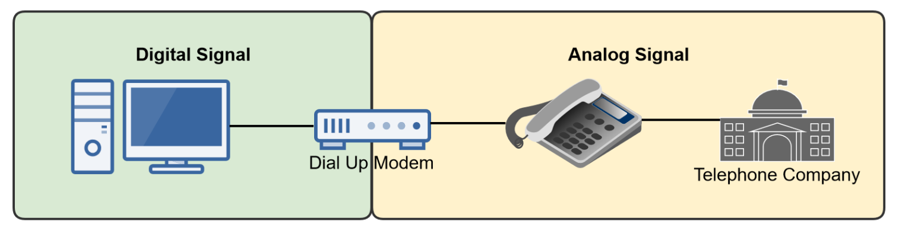
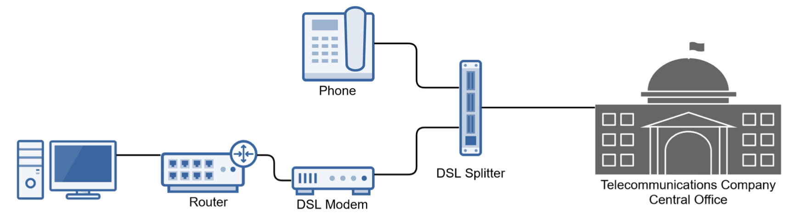

# Wide Area Networking

## WAN Connection Types

- WAN connections can be broken up into three different categories:
  - Circuit-Switched Connections
  - Packet-Switched Connections
  - Dedicated Leased Lines

### Circuit-Switched Connection

- Designed in 1878, was originally designed for telephone calls.
- Uses a dedicated point-to-point connection (circuit) using a telecommunications network.
  - Creates a dedicated link with fixed bandwidth between communicating nodes.
  - Others can't utilize the circuit during the connection, which may waste bandwidth.
  - Transmissions are sent and received in order, unlike with packet switching, where they can arrive out of order.
- Examples:
  - Dedicated Leased-Lines & Dial-Up

### Packet-Switched Connection

- Data is broken into packets, which are routed to different links to the other endpoint.
- The path varies based on the best route at the time the data is sent.
  - Packets may arrive out of order and must be re-assembled in the correct order.
- Unlike circuit switching, packet switching shares bandwidth and connections with others.
- This method of data transmission is the core technology for the Internet and most LANs.
- Packet-switched connections can create virtual circuits.

### Virtual Circuit

- Connection-oriented packet-switched connections create virtual cicuits.
  - A means of forwarding packets of data in such a way that it appears as if there is a dedicated physical link(circuit) between the source and destination.
- Virtual circuits allow service providers to offer better QoS based on a service level agreement(SLA).
- There a re two types:
  - Permanent Virtual Circuit (PVC: Always Exists
  - Switched Virtuall Circuit (SVC): Considered On-Demand

### Dedicated Leased Line

- Like its name implies, it's a dedicated leased line.
- Commonly called a Point-to-Point link.
- A reserved circuit that provides a fixed bandwidth point-to-point data connection, usually between two offices.
  - It's always active and provides a guaranteed bandwidth for a fixed monthly fee.
- The leased line may be a dedicated physical line or a permanent virtual circuit.

---

## WAN Transmission Mediums

### Copper

- Copper cabling is used in a variety to WAN applications:
  - Dial-Up
  - DSL
  - Broadband Cable
- Copper has limited distances and speeds, so fiber is becoming more common.

### Fiber

- Fiber is a popular WAN transmission medium, as it offers extremely fast speeds over long distances.
- Speeds greater than 10Gbps achievable with distances up to 75 miles.
- Synchronous optical networking (SONET) is the standard for fiber WAN transmissions.
- SONET uses the Optial Carrier (OC) standard

### Wireless (Cellular)

- 4G and 5G cellular technologies make wireless cellular a realistic option for WAN connectivity.
  - Average 4G Speeds: 25 to 30 Mbps
  - Average 5G Speeds: 40 Mbps to 1.5Gbps
- Dedicated devices and phones can be utilized as Internet hotspots in places where other options aren't available:
  - Ships, Places, Remote Locations

### Satellite

- A viable solution when wired connections aren't available.
  - Typical speeds range from 12 to 100Mbps
  - Can be expensive
  - Prone to severe latency (delay) problems
  - Sensitive to weather conditions
- The subscriber has a satellite dish installed, which is called a very small aperture terminal (VSAT).

---

## WAN Termination Concepts

- Demarcation (Demac) Point
  - The point where the ISP's network ends and the organiztaion's network begins.
  - The dividing line between the service provider and customer's network.
- Channel Service Unit/Data Service Unit (CSU/DSU)
  - A WAN connectivity device that connects a WAN link to a customer's LAN, and is typically a modem.
  - The CSU connects to the network service provider's network, while the DSU connects to the customer's data termination equipment (DTE), which is typically a router.
- Smart Jack
  - A smart jack is often used with a CSU/DSU, which enables the service provider to diagnosis network issues and perform loopback tests.

---

## WAN Broadband Service

Dial-Up, T-Carrier Signal Lines, DSL, Cable Broadband, Metropolitan Ethernet

### Dial-Up

- The original Internet connection methodology.
  - 56Kbps (kilobits per second) maximum speed.
- Uses POTS (Plan Old Telephone Service) also referred to as a PSTN (Public Switched Telephone Network)
- Utilizes Circuit Switching
  - A modem initiates a call and the dedicated circuit exists only while the connection is active.

### T-Carrier & E-Carrier Digital Signal Lines

- Commonly referred to as "dedicated" leased lines, because they are leased from the telecommunications company to provide a dedicated circuit.
  - Circuit-Switched Technology
- T-Carrier and E Carrier Locations:
  - T-Carrier Lines: North America, Japan, and South Korea
  - E-Carrier Lines: Europe

#### Comparing T1, E1, T3, and E3 Speeds

| Type     | Speed      | Dtails                   |
| -------- | ---------- | ------------------------ |
| DS0      | 64Kbps     | Single Channel           |
| T1 (DS1) | 1.544Mbps  | 24 x DS0 64Kbps Channels |
| E1 (DS1) | 2.048Mbps  | 30 x DS0 64Kbps Channels |
| E3 (DS3) | 34.368Mbps | 512 x 64Kbps Channels    |
| T3 (DS3) | 44.736Mbps | 672 x 64Kbps Channels    |

### Digital Subscriber Line (DSL)

- High-Speed Internet technology utilizing POTS.
  - Sends data digitally over telephone lines.
  - Utilizes a DSL modem and splitter to accomplish this task.
- DSL Limitation:
  - DSL modem must be within 4,000 to 18,000 ft. of telecommunications compnay's central office (CO) based on the type of DSL.

#### Types of DSL

- Asymmetric DSL (ADSL)
  - Consumer verion of DSL that allocates more bandwidth to downstream than upstream data flow.
  - Latest version (ADSL+) offers download speeds around 24 Mbps and upload speeds round 1 Mbps.
- Symmetric DSL (SDSL)
  - Provides equal bandwidth for downstream and upstream data flows.
    - 1.544 Mbps (U.S. and Canada) - T1 Equivalent
    - 2.048 Mbps (Europe) - E1 Equivalent
  - Less popular in residential installations.
- Very High Bitrate DSL (VDSL)
  - Today's replacement for ADSL and SDSL.
  - Latest version (VDSL2-Vplus) can provide the following speeds:
    - Asymmetric: 300 Mbps download and 100 Mbps upload.
    - Symmetric: 100 Mbps download and upload
