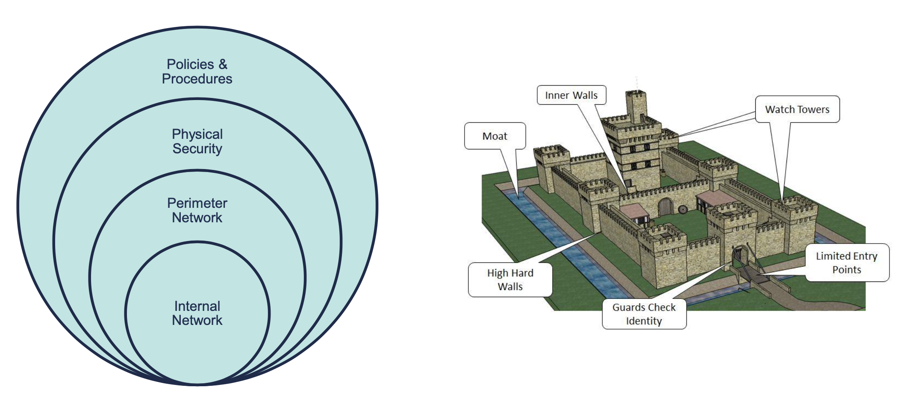
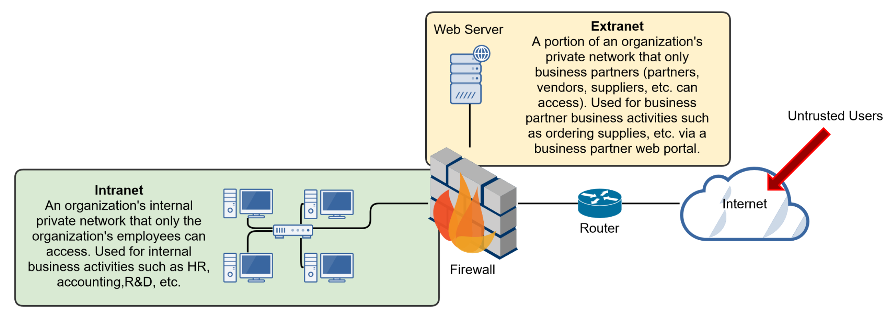
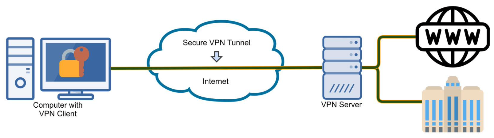

# Network Security

## The CIA Triad

- Confidentiality
- Integrity
- Availability

All 3 equally important & intertwined

---

## Least Privilege

A user, system, process, or application is only given the permissions necessary to complete its assigned tasks or functions and nothing more.

- Implementing Least Privilege:
  - Security Groups
  - Account Standardization
  - Account Management Processes & Procedures

---

## Acceptable Use Policy

- Personnel are often required to read and acknowledge acceptable use policies.
- An acceptable use policy will define the purpose of IT systems, how users can access them, and the responsibilities of users when accessing the systems.
- Defines what is acceptable and not acceptable, as well as penalties for performing non-acceptable activities.

---

## Defense in Depth

---

## Intranet, Extranet and the Internet

---

## Virtual Private Network (VPN)

- A virtual private network (VPN) allows you to remotely connect to a private network or the Internet in a secure, encrypted manner.
- Once connected to the Internet with a VPN client, a tunneling protocol is used to create a protected tunnel through the Internet to the VPN server.
- Tunneling basically means encapsulating one protocol within another to ensure that a transmission is secure.

### VPN Services

- A VPN service encrypts your Internet usage, provides online anonymity, and can trick your service (Netflix, Amazon) into thinking you're in a different location.

### Business Types of VPN

- Remote Access VPNs (Client-to-Site)
  - Allows employees to securely connect to an organization's internal network remotely through the use of VPN client software installed on their machine.
- Site-to-Site VPNs (Intranet VPNs)
  - Allows an organization to securely connect two or more remote sites together over the Internet.

---

## Firewalls

- Firewalls are the foundation of a defense-in-depth network security strategy.
- They're designed to protect organizations from network-based attacks.
- Firewalls do this by filtering data packets that go through them.
- They can be a standalone network device or software on a computer system, meaning network-based (hardware) or host based (software)

### 3 Common Types of Firewalls

- 1st Generation: Packet Filtering Firewalls
- 2nd Generation: Circuit-Level Firewalls
- 3rd Generation: Application-Level Firewalls

### 1st Gen: Packet Filtering Firewalls

- 1st generation and most basic type of firewall.
- They inspect all data packets that attempt to traverse it, and based on predefined rules, packets are either allowed or denied.
- These predefined rules are commonly called an Access Control List (ACL)
- Considered stateless firewalls.
- Packet filtering rules are common TCP/IP packet attributes:
  - IP Address
    - Source IP Address
    - Destination IP Address
  - TCP/UDP Port
    - Source TCP/UDP Port
    - Destination TCP/UDP Port
  - Inbound or Outbound
    - Inbound firewall network interface
    - Outbound firewall network interface

### 2nd Gen: Stateful Inspection Firewalls

- Operate at the Transport Layer of the OSI Model (Layer 4) and monitor TCP sessions.
- Determine the legitimacy of a requested session by monitoring the 3-way handshake between packets.
- Valid TCP sessions are allowed to pass, while invalid and terminated sessions are not.
  - Hackers can alter the 3-way handshake process or malicious reasons.
  - If the firewall believes an attack is occurring, it will block the traffic.

### 3rd Gen: Application-Level Firewalls

- Also known as proxy servers, these firewalls operate at the Application Layer of the OSI Model (Layer 7).
- Specifically, proxy servers can provide the following services:
  - Filter: Filters packets based on an application or service (FTP, SMTP, etc.).
  - Caching: Provides caching services, for example:
    - When you request a page from a website, proxy server will retrieve it and then cache it in its memory.
    - The next time someone requests that website, the proxy server can retrieve it from its cache.
    - This saves Internet bandwidth.
  - Logging: Has the ability to log user activity for auditing purposes.

---

## Web Proxy Server

- Acts on behalf of computers within a LAN to retrieve web content from the Internet.
- Specifically, proxy servers can provide the following services.
  - Filtering: Can acts as a filtering service, similar to a firewall. Can restrict and filter out unwanted websites (gambling, social media, etc.)
  - Content Checking; Similar to an application-layer firewall, a proxy server can verify that content is valid and doesn't contain malicious content.
  - Caching: When you request a page from a website, the proxy server will retrieve it and then cache it in its memory. The next time someone requests that website, the proxy server can retrieve it from its cache - this saves Internet bandwidth.

---

## Network Intrusion Detection & Prevention

### Intrusion Detection & Prevention Systems (IDS/IPS)

- Are designed to detected attack on a network and respond passively or actively.
- An Intrusion Detection System (IDS) is **Passive**, meaning it's response is logging and notifying.
- An Intrusion Prevention System (IPS) is **Active**, meaning it'll change the network environment to stop an attack, such as changing ACLs or closing processes, sessions, or ports.
